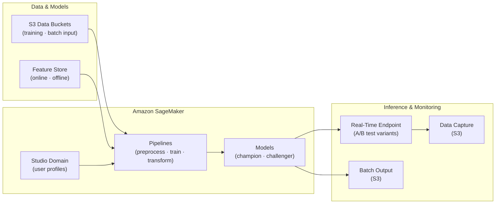

# tf-aws-data-e-sagemaker Examples

Runnable examples for the [`tf-aws-data-e-sagemaker`](../) Terraform module.

## Available Examples

| Example | Description |
|---------|-------------|
| [minimal](minimal/) | Minimal configuration — single SageMaker Studio domain with IAM authentication deployed in a private VPC |
| [complete](complete/) | Full configuration with Studio domain, user profiles, training and batch-inference pipelines, A/B test endpoint (champion/challenger models with data capture), online and offline feature groups, and CloudWatch alarms |

## Architecture



## Quick Start

```bash
cd minimal/
terraform init
terraform apply -var-file="dev.tfvars"
```
