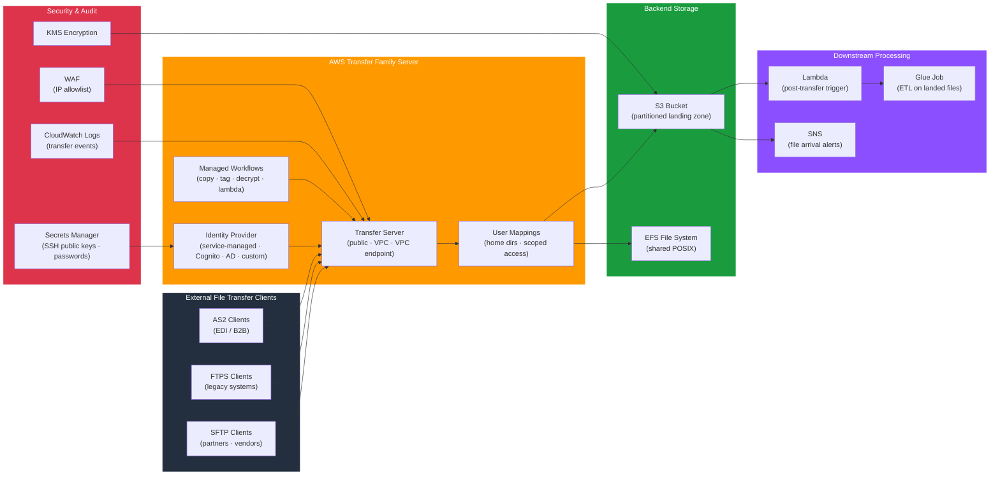

# tf-aws-data-e-transfer

Data Engineering module for AWS Transfer Family — managed SFTP, FTPS, and FTP servers for secure file exchange integrated with S3 and EFS backends.

---

## Architecture



---

## Features

- Managed SFTP, FTPS, FTP, and AS2 (EDI) protocol endpoints
- Endpoint types: public (internet-facing), VPC (internal), VPC with Elastic IPs
- Identity providers: service-managed (SSH keys), AWS Cognito, Microsoft AD, custom Lambda authoriser
- Per-user home directory mapping (scoped to S3 prefix or EFS path)
- Managed Workflows: post-upload copy, tag, decrypt, custom Lambda processing
- CloudWatch logging for all transfer events
- WAF IP-based allowlisting for SFTP servers
- KMS-encrypted S3 and EFS backends

## Security Controls

| Control | Implementation |
|---------|---------------|
| Authentication | SSH public key or password via identity provider |
| Authorisation | Home dir scoping per user — no cross-user access |
| Encryption in transit | SFTP (SSH), FTPS (TLS 1.2+), AS2 (S/MIME) |
| Encryption at rest | KMS CMK on S3 and EFS |
| IP restriction | WAF allowlist or VPC security group |
| Audit | CloudWatch Logs for all upload/download events |

## Versioning

Use explicit git tags such as `?ref=v1.0.0` to pin your deployments.

## Usage

```hcl
module "transfer" {
  source = "git::https://github.com/your-org/golden_modules.git//tf-aws-data-e-transfer?ref=v1.0.0"

  # Supporting infrastructure — Transfer server provisioned separately or via console
  # This module exposes region/account data sources for policy construction
}

# Transfer Family server
resource "aws_transfer_server" "sftp" {
  protocols              = ["SFTP"]
  endpoint_type          = "VPC"
  identity_provider_type = "SERVICE_MANAGED"

  endpoint_details {
    subnet_ids         = module.vpc.private_subnet_ids
    vpc_id             = module.vpc.vpc_id
    security_group_ids = [aws_security_group.sftp.id]
  }

  logging_role = aws_iam_role.transfer_logging.arn
  tags         = local.common_tags
}

resource "aws_transfer_user" "partner" {
  server_id = aws_transfer_server.sftp.id
  user_name = "partner-acme"
  role      = aws_iam_role.transfer_user.arn

  home_directory_type = "LOGICAL"
  home_directory_mappings {
    entry  = "/"
    target = "/${aws_s3_bucket.landing.id}/partners/acme"
  }
}
```

## Protocol Comparison

| Protocol | Port | Auth | Encryption | Use Case |
|---------|------|------|-----------|---------|
| SFTP | 22 | SSH key / password | SSH transport | Standard secure transfer |
| FTPS | 990/21 | Certificate / password | TLS | Legacy FTP replacement |
| FTP | 21 | Password | None (VPC only) | Internal legacy systems |
| AS2 | 443 | Certificates | TLS + S/MIME | EDI / B2B messaging |

## Examples

- [Public SFTP with S3](examples/sftp-public/)
- [VPC SFTP with partner users](examples/sftp-vpc/)
- [AS2 EDI integration](examples/as2-edi/)
