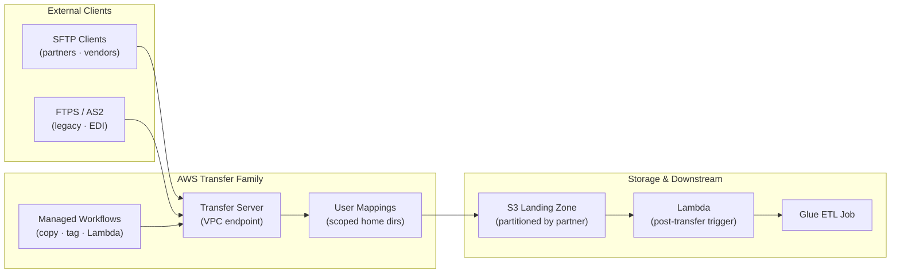

# tf-aws-data-e-transfer Examples

Runnable examples for the [`tf-aws-data-e-transfer`](../) Terraform module.

## Available Examples

| Example | Description |
|---------|-------------|
| [minimal](minimal/) | Minimal configuration — public-facing SFTP server with service-managed SSH key authentication and an S3 landing bucket |
| [complete](complete/) | Full configuration with VPC SFTP server, per-partner scoped home directories, managed post-upload workflows, CloudWatch logging, WAF IP allowlist, KMS-encrypted S3 backend, and downstream Lambda trigger |

## Architecture



## Quick Start

```bash
cd minimal/
terraform init
terraform apply -var-file="dev.tfvars"
```
