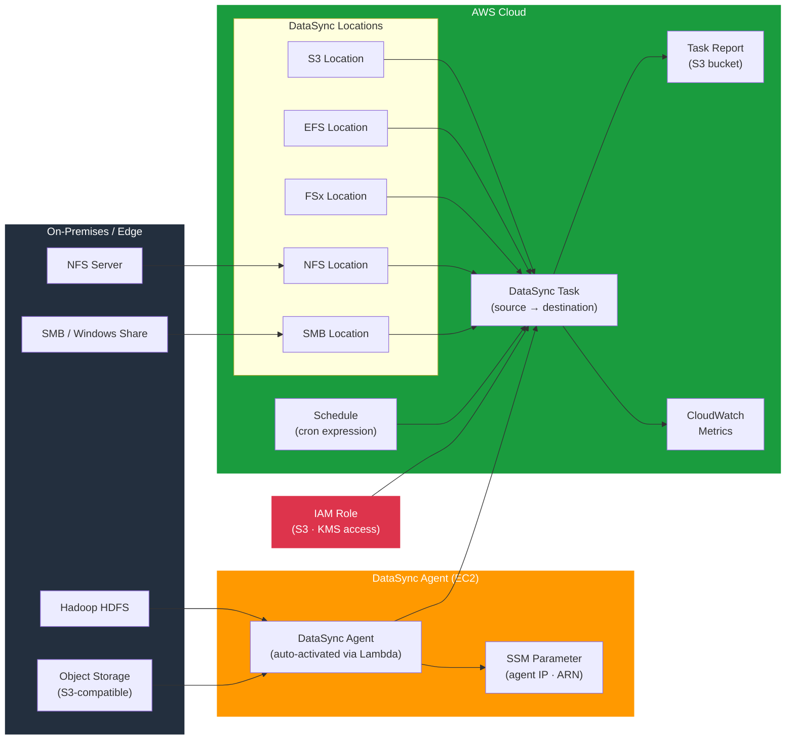

# tf-aws-datasync

Terraform module for AWS DataSync — automated data transfer agents, multi-protocol location support (S3, EFS, NFS, SMB, FSx, HDFS, object storage), and scheduled transfer tasks.

---

## Architecture



---

## Features

- DataSync Agent deployment on EC2 with automated activation via Lambda
- Agent IP and ARN stored in SSM Parameter Store for cross-stack reference
- Location support: S3, EFS, FSx (Windows, Lustre, OpenZFS), NFS, SMB, HDFS, object storage
- Transfer tasks with configurable options: atime, mtime, verify mode, posix permissions
- Include/exclude filter patterns for selective file transfers
- Scheduled tasks with cron expressions
- Task report delivery to S3

## Security Controls

| Control | Implementation |
|---------|---------------|
| Agent communication | TLS encrypted DataSync protocol |
| S3 access | Scoped IAM role with `kms_key_arn` support |
| Agent network isolation | Deploy in private subnet with security group |
| Credential management | SMB/HDFS credentials via Secrets Manager |

## Versioning

Use explicit git tags such as `?ref=v1.0.0` to pin your deployments.

## Usage

```hcl
module "datasync" {
  source = "git::https://github.com/your-org/golden_modules.git//tf-aws-datasync?ref=v1.0.0"

  # Deploy and auto-activate an agent
  agents = {
    primary = {
      subnet_id          = module.vpc.private_subnet_ids[0]
      security_group_ids = [aws_security_group.datasync.id]
      instance_type      = "m5.2xlarge"
    }
  }

  # S3 source location
  s3_locations = {
    source = {
      s3_bucket_arn = module.source_bucket.arn
      s3_subdirectory = "/data/incoming"
      agent_keys    = ["primary"]
    }
  }

  # EFS destination location
  efs_locations = {
    destination = {
      efs_file_system_arn = module.efs.file_system_arn
      ec2_config = {
        subnet_arn          = "arn:aws:ec2:us-east-1:123:subnet/subnet-xxx"
        security_group_arns = [aws_security_group.efs.arn]
      }
    }
  }

  tasks = {
    s3_to_efs = {
      source_location_key      = "s3"
      source_location_type     = "s3"
      destination_location_key = "efs"
      destination_location_type = "efs"
      schedule_expression      = "cron(0 1 * * ? *)"
      options = {
        verify_mode           = "ONLY_FILES_TRANSFERRED"
        posix_permissions     = "PRESERVE"
        preserve_deleted_files = "REMOVE"
      }
    }
  }
}
```

## Supported Location Types

| Type | Protocol | Use Case |
|------|---------|---------|
| S3 | HTTPS | Cloud-to-cloud or on-prem to S3 |
| EFS | NFS | Linux file share migration |
| FSx for Windows | SMB | Windows share migration |
| FSx for Lustre | NFS | HPC storage migration |
| NFS | NFS v3/v4 | On-premises NFS servers |
| SMB | SMB 2/3 | Windows file servers |
| HDFS | HDFS | Hadoop cluster migration |

## Examples

- [NFS to S3](examples/nfs-to-s3/)
- [S3 to EFS sync](examples/s3-to-efs/)
