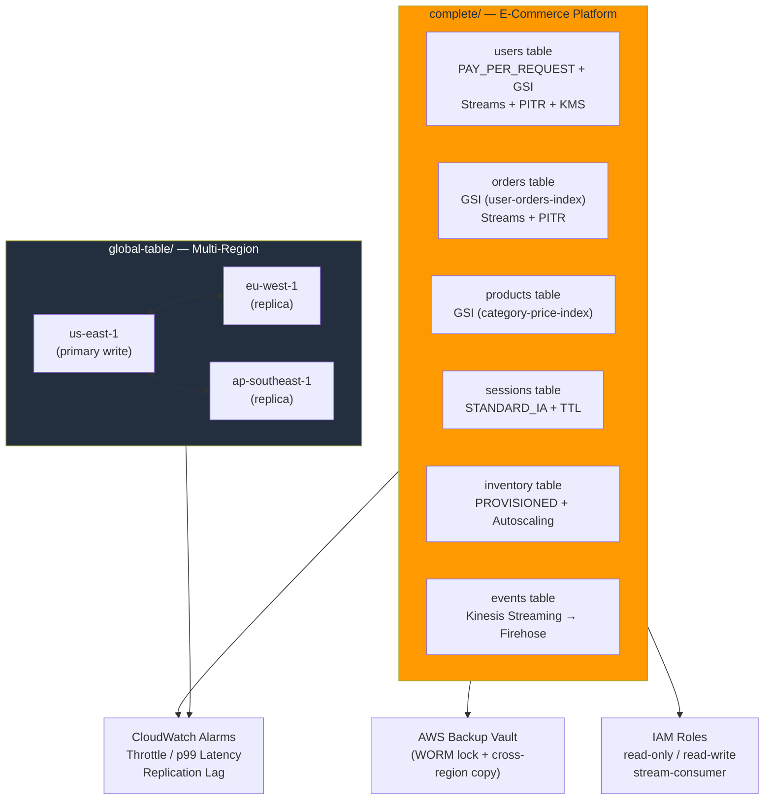

# tf-aws-dynamodb Examples

Runnable examples for the [`tf-aws-dynamodb`](../) Terraform module.

## Available Examples

| Example | Description |
|---------|-------------|
| [complete](complete/) | Full e-commerce platform — 6 tables with GSI/LSI, autoscaling, PITR, KMS, Streams, CloudWatch alarms, and AWS Backup |
| [global-table](global-table/) | Multi-region active-active Global Tables replicated across us-east-1, eu-west-1, and ap-southeast-1 |

## Architecture



## Quick Start

```bash
# Complete e-commerce example
cd complete/
terraform init
terraform apply -var-file="terraform.tfvars"

# Global table example
cd global-table/
terraform init
terraform apply -var-file="terraform.tfvars"
```
