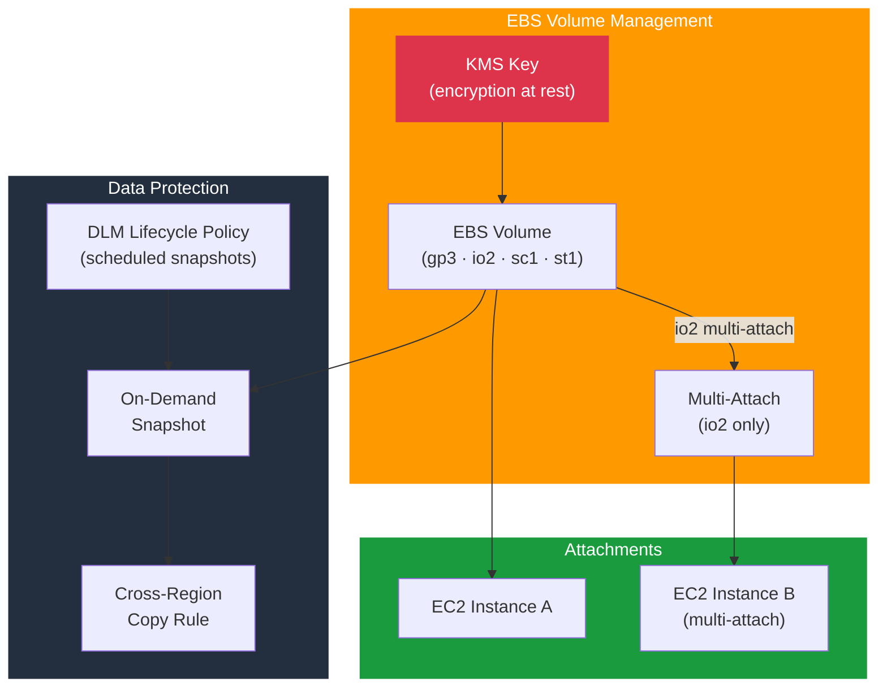

# tf-aws-ebs

Terraform module for Amazon EBS — encrypted volumes, multi-attach (io2), volume attachments, on-demand snapshots, and DLM automated snapshot lifecycle policies.

---

## Architecture



---

## Features

- EBS volumes across all types: `gp3`, `io2`, `sc1`, `st1`
- Customer-managed KMS encryption on all volumes
- Multi-attach support for `io2` volumes shared across EC2 instances
- Volume attachments with configurable device names
- On-demand snapshots with `prevent_destroy` lifecycle protection
- DLM (Data Lifecycle Manager) policies for automated, scheduled snapshots
- Cross-region snapshot copy rules via DLM

## Security Controls

| Control | Implementation |
|---------|---------------|
| Encryption at rest | `kms_key_arn` — CMK required |
| Snapshot protection | `lifecycle { prevent_destroy = true }` on permanent snapshots |
| Access control | Attach only to tagged/named instances |

## Versioning

Use explicit git tags such as `?ref=v1.0.0` to pin your deployments.

## Usage

```hcl
module "ebs" {
  source = "git::https://github.com/your-org/golden_modules.git//tf-aws-ebs?ref=v1.0.0"

  kms_key_arn = module.kms.key_arn

  volumes = {
    data = {
      availability_zone = "us-east-1a"
      size              = 500
      type              = "gp3"
      iops              = 3000
      throughput        = 125
    }
    database = {
      availability_zone    = "us-east-1a"
      size                 = 1000
      type                 = "io2"
      iops                 = 16000
      multi_attach_enabled = true
    }
  }

  volume_attachments = {
    data_to_app = {
      volume_key  = "data"
      instance_id = aws_instance.app.id
      device_name = "/dev/xvdf"
    }
  }

  # DLM daily snapshot with 7-day retention
  dlm_enabled          = true
  dlm_schedule_cron    = "cron(0 3 * * ? *)"
  dlm_retain_count     = 7
}
```

## Volume Type Reference

| Type | IOPS | Throughput | Use Case |
|------|------|-----------|----------|
| `gp3` | 3,000–16,000 | 125–1,000 MB/s | General purpose |
| `io2` | Up to 256,000 | Up to 4,000 MB/s | Databases, multi-attach |
| `st1` | — | Up to 500 MB/s | Big data, sequential |
| `sc1` | — | Up to 250 MB/s | Cold archival |

## Examples

- [Basic](examples/basic/)
- [io2 Multi-Attach Cluster](examples/multi-attach/)
