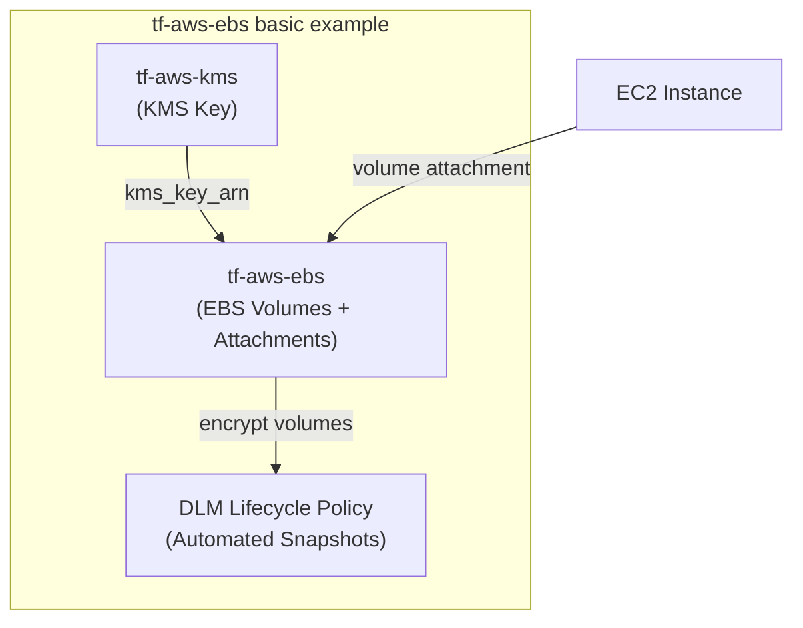

# tf-aws-ebs Examples

Runnable examples for the [`tf-aws-ebs`](../) Terraform module.

## Available Examples

| Example | Description |
|---------|-------------|
| [basic](basic/) | Minimal configuration — creates EBS volumes with KMS encryption, optional volume attachments, and a DLM lifecycle policy for automated snapshots |

## Architecture



## Quick Start

```bash
cd basic/
terraform init
terraform apply -var-file="dev.tfvars"
```
