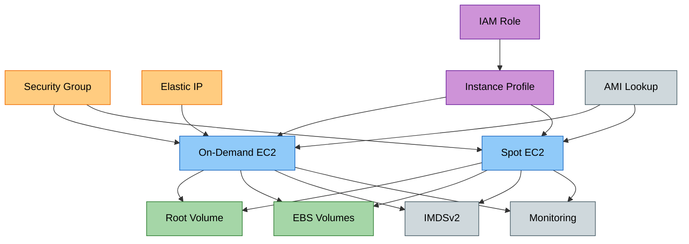

# tf-aws-ec2

Terraform module for AWS EC2 instances with security-hardened defaults.

## Features

- On-demand or Spot instance
- Auto-selects latest Amazon Linux 2023 AMI if no AMI specified
- IMDSv2 required by default (prevents SSRF metadata attacks)
- Encrypted root + data volumes by default (KMS configurable)
- `disable_api_termination = true` by default (termination protection)
- Detailed CloudWatch monitoring enabled by default
- Elastic IP support
- Multiple EBS volumes via `ebs_volumes` map
- CPU options and credit specification

## Security Controls

| Control | Default |
|---------|---------|
| IMDSv2 required | `http_tokens = "required"` |
| Root volume encrypted | `true` |
| Termination protection | `disable_api_termination = true` |
| No public IP | `associate_public_ip_address = false` |
| `lifecycle.prevent_destroy` | `true` |
| `lifecycle.ignore_changes [ami]` | AMI drift won't cause replacement |

## Architecture





## Versioning

Review [CHANGELOG.md](CHANGELOG.md) before selecting a module version. Use explicit git tags such as `?ref=v1.0.0`, `?ref=v1.1.0`, or `?ref=v2.0.0` so deployments stay predictable.
## Usage

```hcl
module "ec2_fleet" {
  source = "git::https://github.com/shaikis/golden_modules.git//tf-aws-ec2?ref=main"

  name_prefix = "app"
  environment = "dev"

  instances = {
    app01 = {
      instance_type          = "t3.medium"
      subnet_id              = "subnet-xxxx"
      vpc_security_group_ids = ["sg-xxxx"]
      create_eip             = true
    }

    worker01 = {
      use_spot               = true
      spot_price             = "0.08"
      instance_type          = "t3.large"
      subnet_id              = "subnet-yyyy"
      vpc_security_group_ids = ["sg-yyyy"]
    }
  }
}
```

## Examples

- [Basic](examples/basic/)
- [Complete](examples/complete/)

