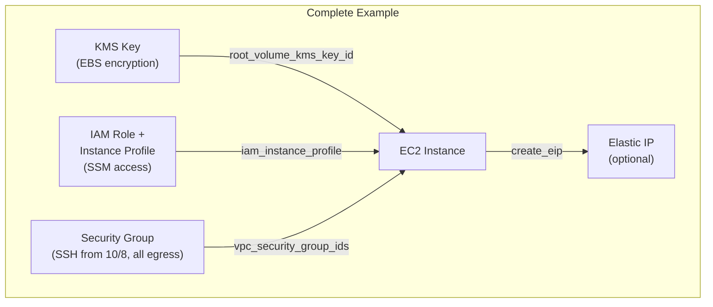

# tf-aws-ec2 Examples

Runnable examples for the [`tf-aws-ec2`](../) Terraform module.

## Available Examples

| Example | Description |
|---------|-------------|
| [basic](basic/) | Minimal configuration — single EC2 instance with essential inputs only (instance type, subnet, key pair, monitoring toggle) |
| [complete](complete/) | Full configuration with KMS-encrypted EBS root volume, dedicated IAM instance role with SSM access, security group, EIP, Spot support, CPU options, and metadata options |

## Architecture



## Quick Start

```bash
cd basic/
terraform init
terraform apply -var-file="dev.tfvars"
```
