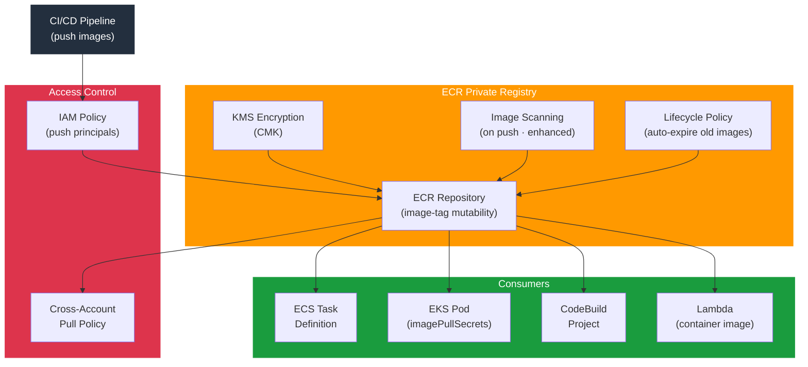

# tf-aws-ecr

Terraform module for Amazon ECR — private container registries with image scanning, KMS encryption, lifecycle policies, and cross-account pull/push access.

---

## Architecture



---

## Features

- Multiple repositories from a single module call (`for_each` keyed by name)
- Image tag mutability: `MUTABLE` or `IMMUTABLE`
- On-push image scanning (basic) or enhanced scanning (Inspector v2)
- KMS customer-managed key encryption
- Lifecycle policies — expire untagged images and keep N tagged images per prefix
- Cross-account repository policy: separate `pull_principals` and `push_principals`
- `force_delete` guard (opt-in) to prevent accidental registry deletion

## Security Controls

| Control | Implementation |
|---------|---------------|
| Immutable tags | `image_tag_mutability = "IMMUTABLE"` |
| Vulnerability scanning | `scan_on_push = true` |
| Encryption at rest | `encryption_type = "KMS"`, `kms_key_arn` |
| Least-privilege access | Separate push / pull IAM principals |
| Deletion protection | `force_delete = false` (default) |

## Versioning

Use explicit git tags such as `?ref=v1.0.0` to pin your deployments.

## Usage

```hcl
module "ecr" {
  source = "git::https://github.com/your-org/golden_modules.git//tf-aws-ecr?ref=v1.0.0"

  kms_key_arn = module.kms.key_arn

  repositories = {
    api = {
      image_tag_mutability = "IMMUTABLE"
      scan_on_push         = true
      force_delete         = false
    }
    worker = {
      image_tag_mutability = "IMMUTABLE"
      scan_on_push         = true
    }
  }

  # Keep last 10 tagged images per repo; expire untagged after 1 day
  tagged_image_count   = 10
  untagged_image_count = 1
  lifecycle_tag_prefixes = ["v", "release-"]

  # Allow ECS task execution role to pull
  pull_principals = [module.ecs.task_execution_role_arn]

  # Allow CodeBuild to push
  push_principals = [module.codebuild.service_role_arn]
}
```

## Lifecycle Policy Behaviour

| Rule | Condition | Action |
|------|-----------|--------|
| Untagged cleanup | `imageCountMoreThan = 1`, `sinceImagePushed = 1 day` | Expire |
| Tagged retention | Count > `tagged_image_count` per prefix | Expire oldest |
| Release tags | Prefix matches `lifecycle_tag_prefixes` | Retain N images |

## Examples

- [Basic](examples/basic/)
- [Multi-repo with cross-account access](examples/cross-account/)
