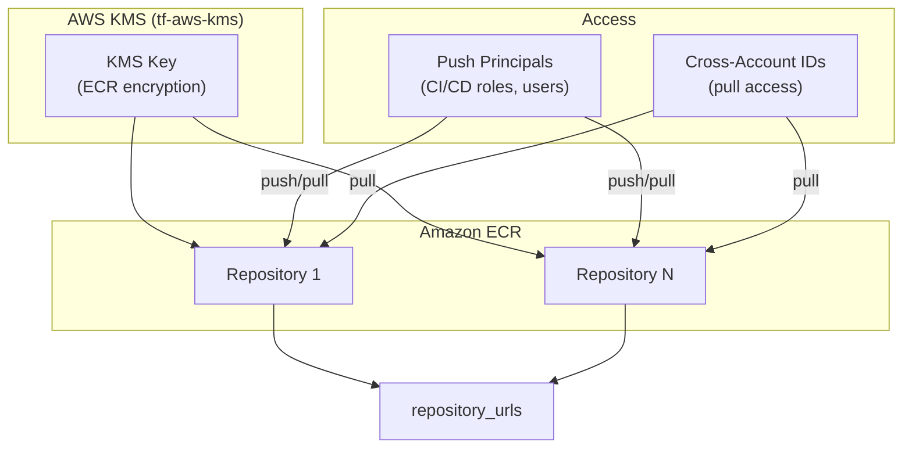

# tf-aws-ecr Examples

Runnable examples for the [`tf-aws-ecr`](../) Terraform module.

## Available Examples

| Example | Description |
|---------|-------------|
| [basic](basic/) | One or more ECR repositories with KMS encryption (via tf-aws-kms), configurable push principal ARNs, and optional cross-account access |

## Architecture



## Quick Start

```bash
cd basic/
terraform init
terraform apply -var-file="dev.tfvars"
```
