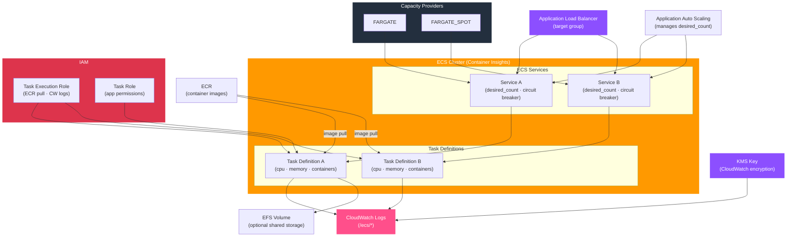

# tf-aws-ecs

Terraform module for AWS ECS clusters, task definitions, and services.

## Features

- ECS cluster with Container Insights enabled by default
- FARGATE, FARGATE_SPOT, and EC2 capacity providers
- Shared task execution IAM role (auto-created)
- Task definitions map with EFS volume support
- Services map with ALB integration, circuit breaker, capacity provider strategies
- `ignore_changes = [desired_count, task_definition]` — Auto Scaling and CI/CD manage these
- `prevent_destroy` on cluster

## Architecture



## Versioning

Review [CHANGELOG.md](CHANGELOG.md) before selecting a module version. Use explicit git tags such as `?ref=v1.0.0`, `?ref=v1.1.0`, or `?ref=v2.0.0` so deployments stay predictable.
## Usage

```hcl
module "ecs" {
  source      = "git::https://github.com/your-org/tf-modules.git//tf-aws-ecs?ref=v1.0.0"
  name        = "platform"
  environment = "prod"
  kms_key_arn = module.kms.key_arn

  task_definitions = {
    api = {
      cpu    = 512
      memory = 1024
      container_definitions = jsonencode([{
        name  = "api"
        image = "123456789.dkr.ecr.us-east-1.amazonaws.com/api:latest"
        portMappings = [{ containerPort = 8080 }]
      }])
    }
  }

  services = {
    api = {
      task_definition_key = "api"
      desired_count       = 2
      network_configuration = {
        subnets         = module.vpc.private_subnet_ids_list
        security_groups = [module.app_sg.security_group_id]
      }
      load_balancers = [{
        target_group_arn = module.alb.target_group_arns["api"]
        container_name   = "api"
        container_port   = 8080
      }]
    }
  }
}
```

