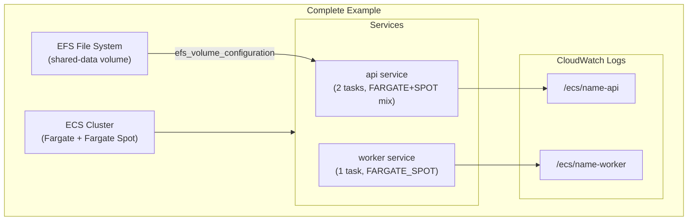

# tf-aws-ecs Examples

Runnable examples for the [`tf-aws-ecs`](../) Terraform module.

## Available Examples

| Example | Description |
|---------|-------------|
| [basic](basic/) | Minimal configuration — single ECS cluster with one task definition (web container) and one Fargate service using CloudWatch Logs |
| [complete](complete/) | Full configuration with Fargate + Fargate Spot capacity provider strategy, two services (API and worker), EFS shared volume, ECS Exec enabled, and mixed capacity provider weights |

## Architecture



## Quick Start

```bash
cd basic/
terraform init
terraform apply -var-file="dev.tfvars"
```
