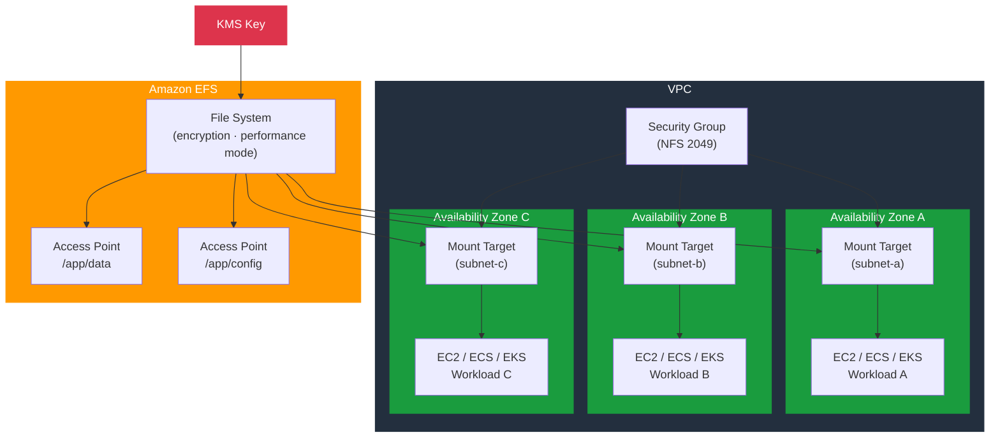

# tf-aws-efs

Terraform module for Amazon EFS — encrypted managed NFS file system with HA mount targets, per-application access points, and optional security group management.

---

## Architecture



---

## Features

- EFS file system with KMS encryption at rest
- Performance modes: `generalPurpose` or `maxIO`
- Throughput modes: `bursting`, `provisioned`, or `elastic`
- HA mount targets — one per subnet/AZ for regional resilience
- Optional security group with configurable allowed CIDRs and security group IDs
- Access points with POSIX UID/GID and root directory creation
- `prevent_destroy` lifecycle guard on the file system

## Security Controls

| Control | Implementation |
|---------|---------------|
| Encryption at rest | `encrypted = true`, `kms_key_arn` (CMK) |
| Encryption in transit | NFS over TLS (Amazon EFS mount helper) |
| Network access | Security group restricts NFS (port 2049) |
| Application isolation | Access points enforce POSIX user/group |
| Deletion protection | `lifecycle { prevent_destroy = true }` |

## Versioning

Use explicit git tags such as `?ref=v1.0.0` to pin your deployments.

## Usage

```hcl
module "efs" {
  source = "git::https://github.com/your-org/golden_modules.git//tf-aws-efs?ref=v1.0.0"

  name             = "shared-storage"
  vpc_id           = module.vpc.vpc_id
  subnet_ids       = module.vpc.private_subnet_ids
  kms_key_arn      = module.kms.key_arn

  performance_mode = "generalPurpose"
  throughput_mode  = "elastic"

  create_security_group      = true
  allowed_security_group_ids = [module.app.security_group_id]

  access_points = {
    app = {
      path        = "/app/data"
      owner_uid   = 1000
      owner_gid   = 1000
      permissions = "755"
      posix_uid   = 1000
      posix_gid   = 1000
    }
  }
}
```

## Throughput Mode Reference

| Mode | Best For | Cost Model |
|------|---------|-----------|
| `bursting` | Workloads with occasional spikes | Included in storage |
| `provisioned` | Consistently high throughput | Per MB/s provisioned |
| `elastic` | Unpredictable, spiky workloads | Per GB transferred |

## Examples

- [Basic Single-AZ](examples/basic/)
- [Multi-AZ with Access Points](examples/multi-az/)
