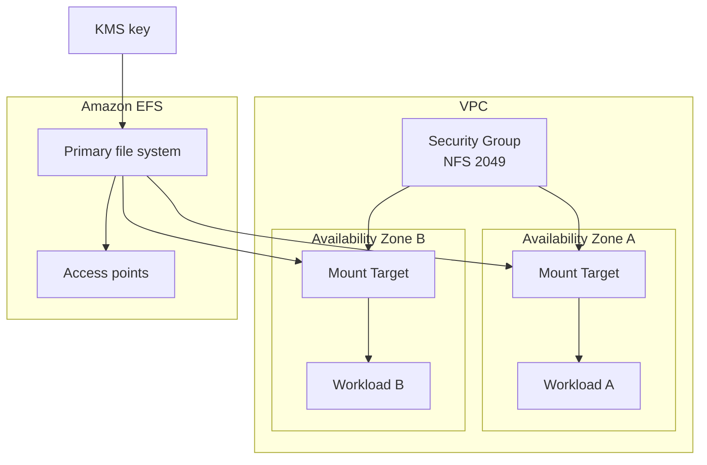
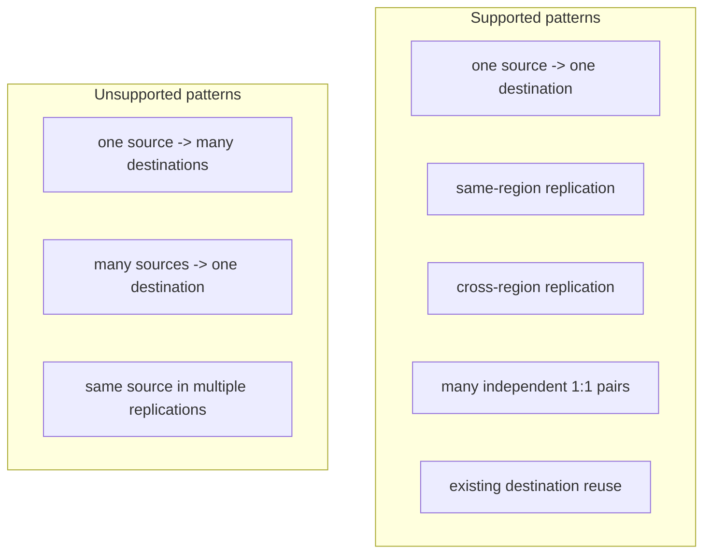
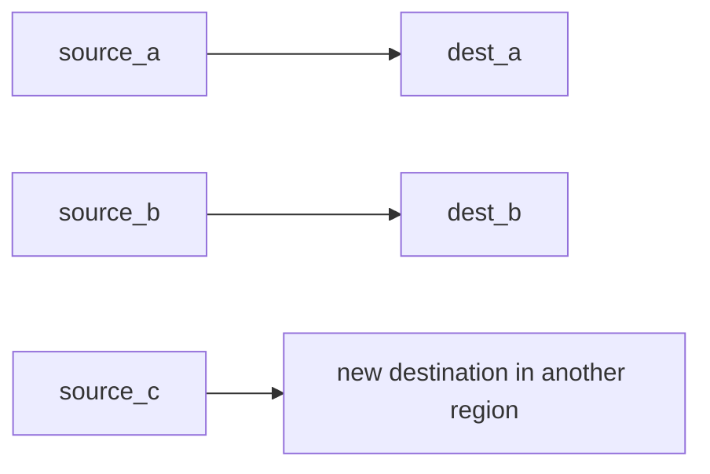

# tf-aws-efs

Terraform module for Amazon EFS with encrypted file systems, HA mount targets, access points, and a more mature replication model.

## What This Module Supports

- One module-managed EFS file system with mount targets and access points
- Optional replication for that module-managed source
- Additional replication configurations for external source file systems
- Same-region replication
- Cross-region replication
- AWS-created new destinations
- Existing destination file systems where the Terraform provider supports them

## EFS Replication Limits

Amazon EFS replication remains **1:1 per file system**.

Supported:
- one source -> one destination
- many independent 1:1 source/destination pairs in one module call
- same-region or cross-region replication

Not supported by the service:
- one source -> many destinations
- many sources -> one destination
- one file system in multiple replication configurations

Cross-account note:
- Amazon EFS supports cross-account replication to an existing destination file system.
- The current Terraform AWS provider schema available here exposes `destination.file_system_id`, but does not expose the IAM role field needed for the full role-based cross-account flow.
- This module therefore documents cross-account possibilities, but does not claim first-class Terraform support for the role-based path yet.

## Architecture

### File System Layer



### Replication Capability Map



### Multi-Pair Pattern



## Usage

### Backward-Compatible Single Replication

```hcl
module "efs" {
  source = "git::https://github.com/your-org/golden_modules.git//tf-aws-efs?ref=v1.0.0"

  name       = "shared-storage"
  vpc_id     = module.vpc.vpc_id
  subnet_ids = module.vpc.private_subnet_ids

  enable_replication                  = true
  replication_destination_region      = "us-west-2"
  replication_destination_kms_key_arn = "arn:aws:kms:us-west-2:123456789012:key/example"
}
```

### Mature Multi-Pair Replication Map

```hcl
module "efs" {
  source = "git::https://github.com/your-org/golden_modules.git//tf-aws-efs?ref=v1.0.0"

  name       = "shared-storage"
  vpc_id     = module.vpc.vpc_id
  subnet_ids = module.vpc.private_subnet_ids

  replications = {
    primary_to_dr = {
      use_module_source       = true
      destination_region      = "us-west-2"
      destination_kms_key_arn = "arn:aws:kms:us-west-2:123456789012:key/example"
    }

    reports_same_region = {
      source_file_system_id      = "fs-0abc123456789def0"
      destination_file_system_id = "fs-0123456789abcdef0"
    }

    analytics_cross_region = {
      source_file_system_id = "fs-0fedcba9876543210"
      destination_region    = "eu-west-1"
    }
  }
}
```

## Replication Inputs

| Name | Type | Default | Description |
|---|---|---|---|
| `enable_replication` | `bool` | `false` | Legacy single-replication toggle |
| `replication_destination_region` | `string` | `null` | Legacy destination region for the default replication |
| `replication_destination_kms_key_arn` | `string` | `null` | Legacy destination KMS key ARN for the default replication |
| `replication_destination_availability_zone` | `string` | `null` | Legacy destination AZ for the default replication |
| `replications` | `map(object)` | `{}` | Map of independent 1:1 replication pairs |

## Replication Outputs

| Name | Description |
|---|---|
| `replication_destination_file_system_id` | Destination file system ID for the legacy/default replication |
| `replication_destination_file_system_ids` | Map of replication key => destination file system ID |
| `replication_configurations` | Map of replication key => normalized source/destination details and status |

## Examples

- [Basic](examples/basic/)
- [Complete](examples/complete/)
