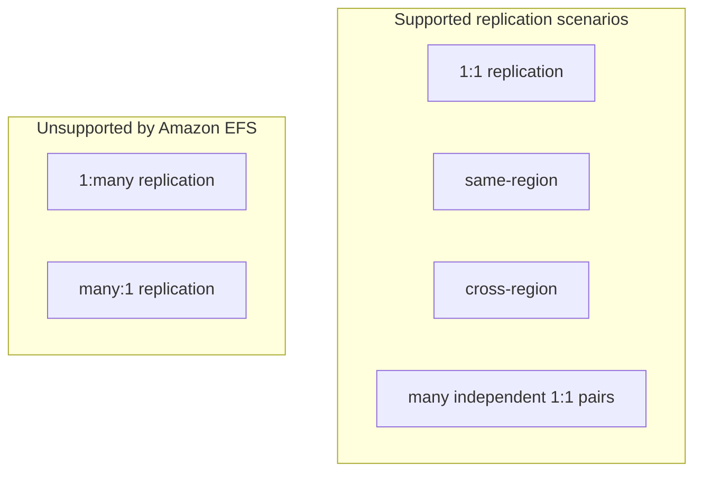

# tf-aws-efs Examples

Runnable examples for the [`tf-aws-efs`](../) Terraform module.

## Available Examples

| Example | Description |
|---------|-------------|
| [basic](basic/) | Minimal configuration for a single EFS source with optional one-to-one replication and managed mount-target security |
| [complete](complete/) | Full configuration with access points, lifecycle policies, backup, and richer one-to-one replication patterns |

## Scenario Map



## Example Notes

- `basic` demonstrates a straightforward 1:1 pattern for a single module-managed source.
- `complete` demonstrates a richer production-oriented 1:1 setup with access points and DR-related options.
- `1:many` and `many:1` are not included as runnable examples because Amazon EFS replication does not support those topologies.

## Quick Start

```bash
cd basic/
terraform init
terraform apply -var-file="dev.tfvars"
```
