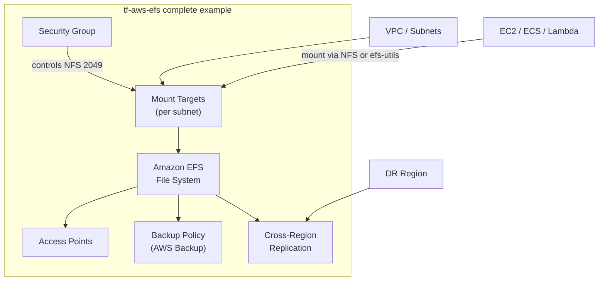

# tf-aws-efs Examples

Runnable examples for the [`tf-aws-efs`](../) Terraform module.

## Available Examples

| Example | Description |
|---------|-------------|
| [basic](basic/) | Minimal configuration — creates an encrypted EFS file system with mount targets, a managed security group, and optional lifecycle/backup policies and cross-region replication |
| [complete](complete/) | Full configuration with access points, NFS and EFS-utils mount helpers, cross-region replication, backup policy, and all lifecycle transition options |

## Architecture



## Quick Start

```bash
cd basic/
terraform init
terraform apply -var-file="dev.tfvars"
```
