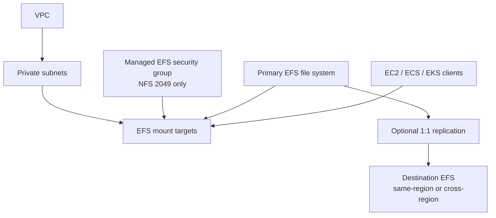

# basic

Minimal EFS example for a single source file system with optional one-to-one replication.

## Architecture



## Scenario Covered

- `1:1` replication
- Regional EFS for multi-AZ when `availability_zone_name = null`
- One Zone EFS for single-AZ when `availability_zone_name` is set
- same-region replication if destination stays in the same Region
- cross-region replication if destination region differs

## Not Covered

- `1:many` replication is not supported by Amazon EFS
- `many:1` replication is not supported by Amazon EFS

## Run

```bash
terraform init
terraform apply -var-file="dev.tfvars"
```
