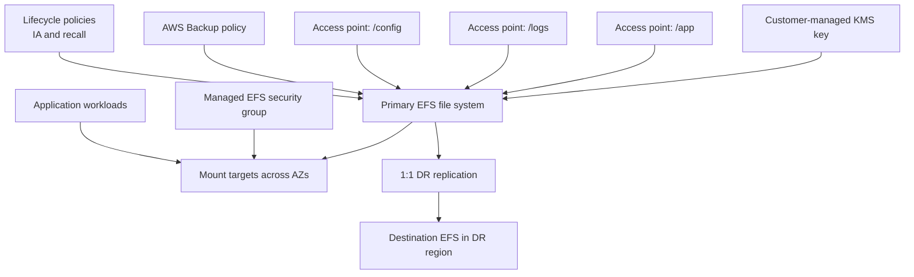

# complete

Production-style EFS example with access points, lifecycle management, backup, and richer one-to-one replication options.

## Architecture



## Scenario Covered

- production-oriented `1:1` replication
- Regional EFS for multi-AZ production layouts when `availability_zone_name = null`
- One Zone EFS for single-AZ deployments when `availability_zone_name` is set
- cross-region DR replication
- same module with mount, backup, lifecycle, and access-point configuration

## Not Covered

- `1:many` replication is not supported by Amazon EFS
- `many:1` replication is not supported by Amazon EFS
- cross-account role-based replication is not first-class in this Terraform module because of current provider schema limits

## Run

```bash
terraform init
terraform apply -var-file="prod.tfvars"
```
