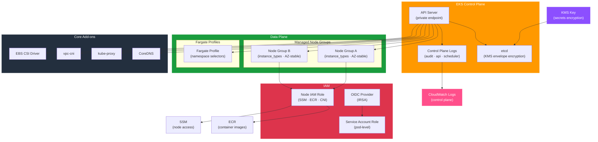

# tf-aws-eks

Terraform module for AWS EKS clusters with production-ready security defaults.

## Features

- EKS cluster with full control plane logging
- Private-only API endpoint by default
- Kubernetes secrets encryption via KMS
- OIDC/IRSA provider (IAM Roles for Service Accounts)
- Managed node groups with `for_each` (AZ-stable)
- Fargate profiles
- Core add-ons: CoreDNS, kube-proxy, vpc-cni, EBS CSI driver
- Node group IAM role with SSM access
- `prevent_destroy` on cluster

## Security Controls

| Control | Default |
|---------|---------|
| Private endpoint only | `endpoint_public_access = false` |
| Secrets envelope encryption | Via `secrets_kms_key_arn` |
| All control plane log types | Enabled by default |
| Node group SSM access | Included in node role |
| IRSA | Enabled |
| Container registry (read-only) | Node role policy |

## Architecture



## Versioning

Review [CHANGELOG.md](CHANGELOG.md) before selecting a module version. Use explicit git tags such as `?ref=v1.0.0`, `?ref=v1.1.0`, or `?ref=v2.0.0` so deployments stay predictable.
## Usage

```hcl
module "eks" {
  source = "git::https://github.com/your-org/tf-modules.git//tf-aws-eks?ref=v1.0.0"

  name               = "platform"
  environment        = "prod"
  subnet_ids         = module.vpc.private_subnet_ids_list
  vpc_id             = module.vpc.vpc_id
  secrets_kms_key_arn = module.kms.key_arn

  node_groups = {
    general = {
      instance_types = ["t3.large"]
      desired_size   = 3
      min_size       = 2
      max_size       = 10
      subnet_ids     = module.vpc.private_subnet_ids_list
    }
  }
}
```

## Version Safety

- `ignore_changes = [scaling_config[0].desired_size]` — Cluster Autoscaler manages replicas.
- Node groups use `for_each` keyed by name — rename safely without destruction.
- Add-on versions are in `ignore_changes` — update managed separately.

## Examples

- [Basic](examples/basic/)
- [Complete](examples/complete/)