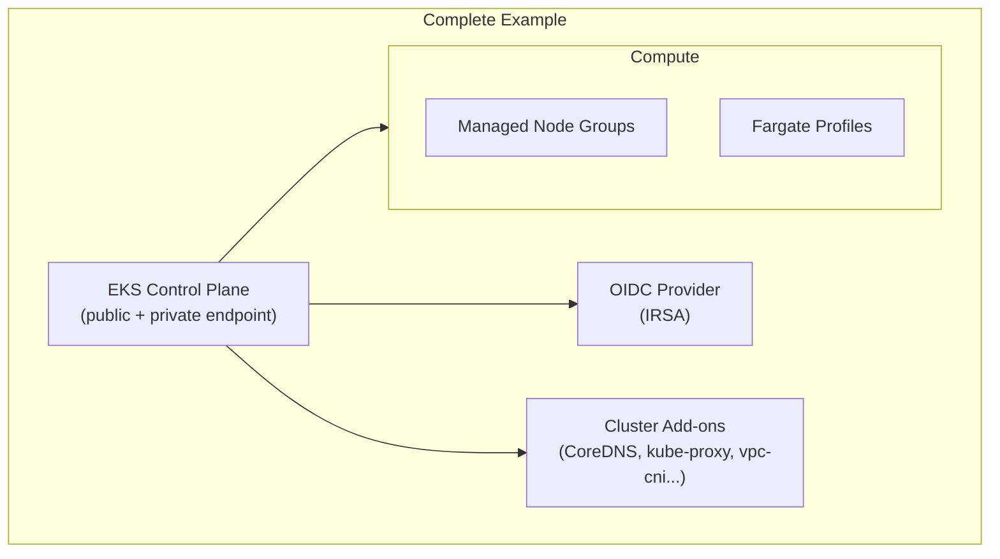

# tf-aws-eks Examples

Runnable examples for the [`tf-aws-eks`](../) Terraform module.

## Available Examples

| Example | Description |
|---------|-------------|
| [basic](basic/) | Minimal configuration — EKS cluster with public/private endpoint access, node groups, and basic outputs (cluster endpoint, OIDC ARN) |
| [complete](complete/) | Full configuration with IRSA enabled, Fargate profiles, cluster add-ons, separate control-plane and node-group subnets, and full tagging |

## Architecture



## Quick Start

```bash
cd basic/
terraform init
terraform apply -var-file="dev.tfvars"
```
