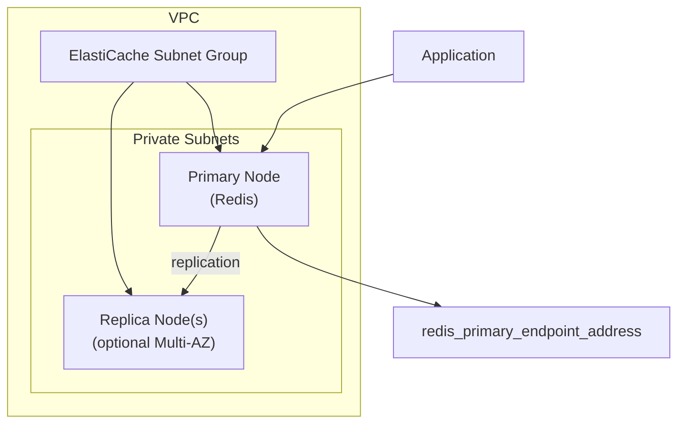

# tf-aws-elasticache Examples

Runnable examples for the [`tf-aws-elasticache`](../) Terraform module.

## Available Examples

| Example | Description |
|---------|-------------|
| [basic](basic/) | Minimal Redis replication group with configurable node type, subnet IDs, and optional Multi-AZ/automatic failover — suitable for development environments |

## Architecture



## Quick Start

```bash
cd basic/
terraform init
terraform apply -var-file="dev.tfvars"
```
