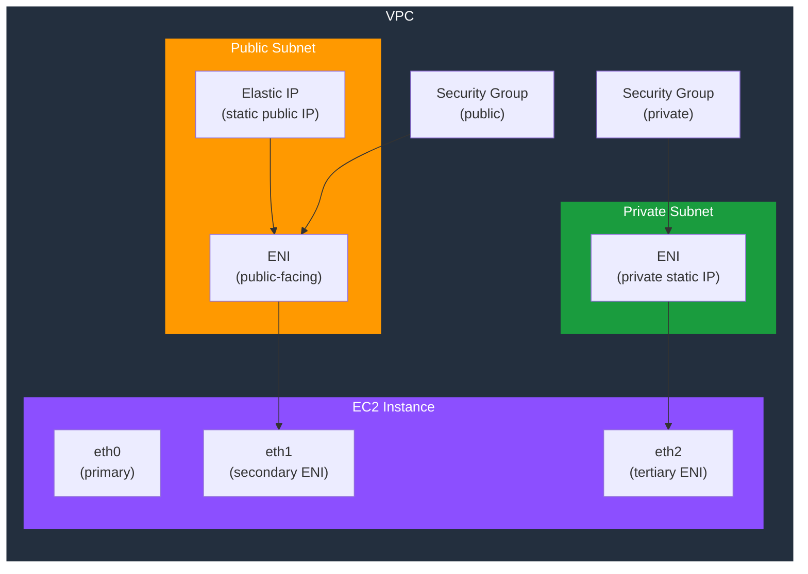

# tf-aws-eni

Terraform module for AWS Elastic Network Interfaces — secondary ENIs, Elastic IP association, multi-homed instances, and static private IP management.

---

## Architecture



---

## Features

- Multiple ENIs with static private IP address assignment
- Elastic IP association per ENI (optional)
- ENI attachment to EC2 instances at configurable device index
- Source/destination check control (required for NAT/routing appliances)
- IPv4 prefix allocation for container networking
- Preserve ENIs across instance replacements for static IP stability

## Security Controls

| Control | Implementation |
|---------|---------------|
| Network isolation | Per-ENI security group assignment |
| Source/dest check | `source_dest_check` — disable for routing appliances |
| Private IP stability | ENI lifecycle independent of EC2 instance |

## Versioning

Use explicit git tags such as `?ref=v1.0.0` to pin your deployments.

## Usage

```hcl
module "eni" {
  source = "git::https://github.com/your-org/golden_modules.git//tf-aws-eni?ref=v1.0.0"

  network_interfaces = {
    public = {
      subnet_id          = module.vpc.public_subnet_ids[0]
      security_group_ids = [aws_security_group.public.id]
      private_ips        = ["10.0.1.10"]
      source_dest_check  = true
    }
    private = {
      subnet_id          = module.vpc.private_subnet_ids[0]
      security_group_ids = [aws_security_group.private.id]
      private_ips        = ["10.0.10.10"]
      source_dest_check  = true
    }
  }

  attachments = {
    public_to_app = {
      eni_key      = "public"
      instance_id  = aws_instance.app.id
      device_index = 1
    }
  }

  elastic_ips = {
    public = {
      eni_key                  = "public"
      domain                   = "vpc"
      associate_with_private_ip = "10.0.1.10"
    }
  }
}
```

## Common Use Cases

| Use Case | Configuration |
|---------|--------------|
| NVA / firewall appliance | `source_dest_check = false` |
| Static IP for DNS | Fixed `private_ips`, Elastic IP |
| Multi-homed instance | Multiple ENIs on different subnets |
| IP migration | Detach/reattach ENI to new instance |

## Examples

- [Basic Secondary ENI](examples/basic/)
- [Multi-homed NAT appliance](examples/multi-homed/)
