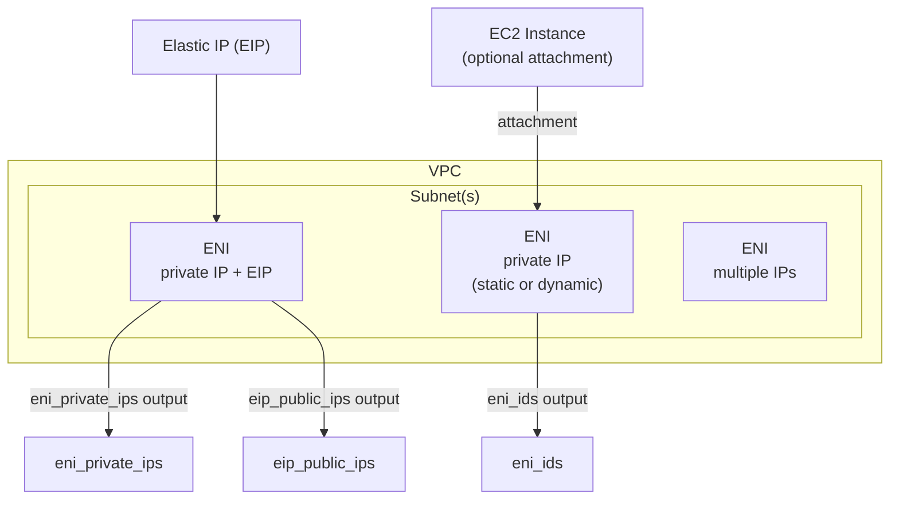

# tf-aws-eni Examples

Runnable examples for the [`tf-aws-eni`](../) Terraform module.

## Available Examples

| Example | Description |
|---------|-------------|
| [basic](basic/) | Minimal configuration — provision one or more Elastic Network Interfaces with optional EIP association using variable-driven network interface definitions |

## Architecture



## Quick Start

```bash
cd basic/
terraform init
terraform apply -var-file="dev.tfvars"
```
