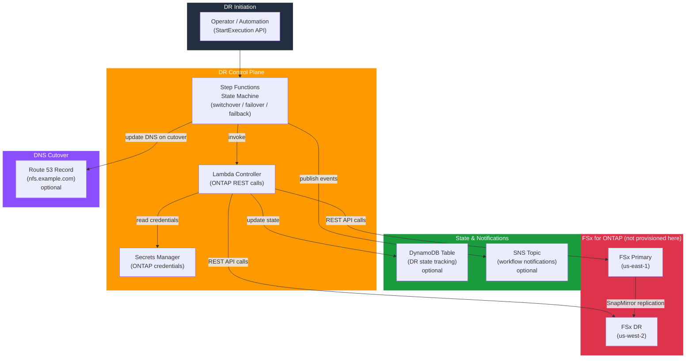

# tf-aws-fsx-dr-control

Terraform module for AWS-native orchestration of FSx for ONTAP disaster recovery operations.

## Architecture



## Scope

This module provisions the control-plane components for DR workflows:
- Step Functions state machine
- Lambda controller for ONTAP REST calls and workflow actions
- optional DynamoDB state tracking
- optional Route 53 cutover support
- optional SNS notifications

This module does not provision FSx for ONTAP itself. It is intended to sit alongside the base FSx provisioning module.

## Requirements

- Terraform `>= 1.3.0`
- AWS provider compatible with the module's `versions.tf`

## Features

- Step Functions workflow for switchover, failover, and failback orchestration
- Lambda controller with optional VPC networking
- Secrets Manager access for ONTAP credentials
- Optional Route 53 DNS cutover support
- Optional DynamoDB table for DR state tracking
- Optional SNS notifications
- Example execution payload outputs for switchover and failback

## Versioning

Review [CHANGELOG.md](CHANGELOG.md) before selecting a module version. Use explicit git tags such as `?ref=v1.0.0`, `?ref=v1.1.0`, or `?ref=v2.0.0` so deployments stay predictable.
## Usage

```hcl
module "fsx_dr_control" {
  source = "../tf-aws-fsx-dr-control"

  name        = "app"
  environment = "prod"

  allowed_secret_arns = [
    "arn:aws:secretsmanager:us-east-1:123456789012:secret:primary-fsxadmin",
    "arn:aws:secretsmanager:us-west-2:123456789012:secret:dr-fsxadmin"
  ]

  dns = {
    zone_id     = "Z1234567890"
    record_name = "nfs.example.com"
  }
}
```

## Inputs

| Name | Type | Default | Description |
|------|------|---------|-------------|
| `name` | `string` | n/a | Base name for DR control resources. |
| `name_prefix` | `string` | `""` | Optional prefix prepended to `name`. |
| `environment` | `string` | `"dev"` | Environment name. |
| `project` | `string` | `""` | Project or product name. |
| `owner` | `string` | `""` | Resource owner tag value. |
| `cost_center` | `string` | `""` | Cost center tag value. |
| `tags` | `map(string)` | `{}` | Additional resource tags. |
| `lambda_subnet_ids` | `list(string)` | `[]` | Private subnets for the controller Lambda when ONTAP endpoints are only reachable inside a VPC. |
| `lambda_security_group_ids` | `list(string)` | `[]` | Security groups for the controller Lambda. |
| `allowed_secret_arns` | `list(string)` | `[]` | Secrets Manager secret ARNs the controller Lambda may read. |
| `create_state_table` | `bool` | `true` | Whether to create a DynamoDB table for DR state tracking. |
| `state_table_name` | `string` | `null` | Existing or custom DynamoDB table name for DR state. |
| `dns` | `object(...)` | `null` | Optional Route 53 record details for DR cutover. |
| `notification_topic_arn` | `string` | `null` | Optional SNS topic ARN for workflow notifications. |
| `lambda_timeout_seconds` | `number` | `120` | Controller Lambda timeout. |
| `lambda_memory_size` | `number` | `256` | Controller Lambda memory size. |
| `cloudwatch_log_retention_days` | `number` | `30` | Log retention for Lambda and Step Functions log groups. |

## Outputs

| Name | Description |
|------|-------------|
| `state_machine_arn` | Step Functions state machine ARN for DR operations. |
| `controller_lambda_arn` | Lambda ARN used by the DR workflow. |
| `state_table_name` | DynamoDB table used to store DR state, if enabled. |
| `switchover_execution_example` | Example Step Functions input for a planned switchover. |
| `failback_execution_example` | Example Step Functions input for failback or reprotect. |

## Notes

- This module provisions orchestration components only; it does not execute a switchover by itself.
- The ONTAP credentials secret format should include `hostname`, `username`, `password`, and optionally `port`.
- Route 53 changes are only enabled when `dns` is provided.
- Place the controller Lambda in private subnets when FSx ONTAP management endpoints are not publicly reachable.

