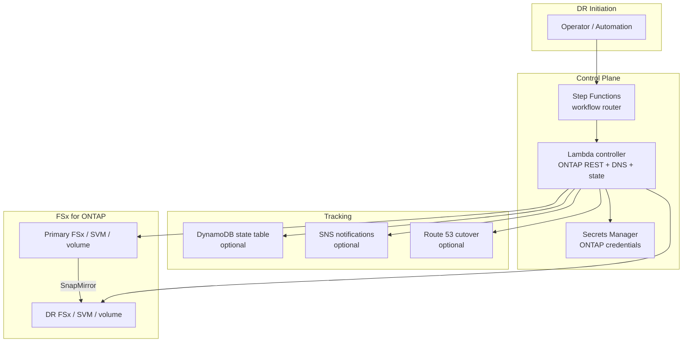
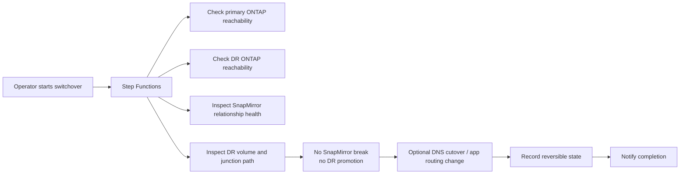
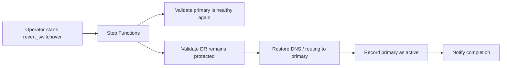
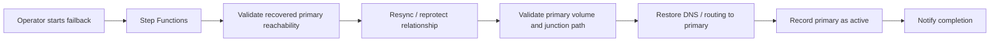

# tf-aws-fsx-dr-control

Terraform module for AWS-native orchestration of FSx for ONTAP disaster recovery control-plane workflows.

## Scope

This module provisions the orchestration layer for DR workflows:
- Step Functions state machine
- Lambda controller for ONTAP REST calls and workflow actions
- optional DynamoDB state tracking
- optional Route 53 cutover support
- optional SNS notifications

This module does not provision FSx for ONTAP itself. It is designed to sit beside your FSx provisioning modules.

## Key Design Rule

Planned `switchover` is modeled as a **non-promoting** workflow. Per NetApp guidance, making the destination volume writable with `snapmirror break` belongs in `failover`, not in planned `switchover`, because promotion can make simple reversal impossible or operationally risky.

## Control Plane Architecture



## Scenario Architecture

### Switchover

Planned, reversible, and **non-promoting**.



### Revert Switchover

Return client access to primary after a planned switchover.



### Failover

Emergency DR activation. This is the path where destination promotion may be required.

```mermaid
flowchart LR
    O["Operator starts failover"] --> S["Step Functions"]
    S --> H1["Attempt primary health check"]
    H1 -->|unreachable or failed| B["Break / promote on DR<br/>using ONTAP REST"]
    B --> V["Verify DR volume is active"]
    V --> J["Verify or enforce junction path"]
    J --> D["Optional DNS cutover to DR"]
    D --> T["Record DR as active"]
    T --> N["Notify completion"]
```



### Failback

Region recovery path after a failover.



## Networking Note

The controller Lambda can communicate with either primary or DR FSx management endpoints from any AWS Region, including Paris, **only if network reachability exists**. Region placement of Lambda does not by itself guarantee connectivity.

Typical requirements:
- the ONTAP management hostname resolves from the Lambda runtime
- routing exists from the Lambda subnets to the FSx management endpoint
- security groups, NACLs, and firewalls allow HTTPS management access
- the relevant Secrets Manager secret for that site is permitted in `allowed_secret_arns`

## Features

- Step Functions workflow router for `switchover`, `revert_switchover`, `failover`, and `failback`
- Lambda controller with optional VPC networking
- Secrets Manager access for ONTAP credentials
- Optional Route 53 DNS cutover support
- Optional DynamoDB table for DR state tracking
- Optional SNS notifications
- Example execution payload outputs for each DR scenario

## Versioning

Review [CHANGELOG.md](CHANGELOG.md) before selecting a module version. Use explicit git tags such as `?ref=v1.0.0`, `?ref=v1.1.0`, or `?ref=v2.0.0` so deployments stay predictable.

## Usage

```hcl
module "fsx_dr_control" {
  source = "../tf-aws-fsx-dr-control"

  name        = "app"
  environment = "prod"

  allowed_secret_arns = [
    "arn:aws:secretsmanager:us-east-1:123456789012:secret:primary-fsxadmin",
    "arn:aws:secretsmanager:eu-west-3:123456789012:secret:dr-fsxadmin"
  ]

  dns = {
    zone_id     = "Z1234567890"
    record_name = "nfs.example.com"
  }
}
```

## Inputs

| Name | Type | Default | Description |
|------|------|---------|-------------|
| `name` | `string` | n/a | Base name for DR control resources. |
| `name_prefix` | `string` | `""` | Optional prefix prepended to `name`. |
| `environment` | `string` | `"dev"` | Environment name. |
| `project` | `string` | `""` | Project or product name. |
| `owner` | `string` | `""` | Resource owner tag value. |
| `cost_center` | `string` | `""` | Cost center tag value. |
| `tags` | `map(string)` | `{}` | Additional resource tags. |
| `lambda_subnet_ids` | `list(string)` | `[]` | Private subnets for the controller Lambda when ONTAP endpoints are only reachable inside a VPC. |
| `lambda_security_group_ids` | `list(string)` | `[]` | Security groups for the controller Lambda. |
| `allowed_secret_arns` | `list(string)` | `[]` | Secrets Manager secret ARNs the controller Lambda may read. |
| `create_state_table` | `bool` | `true` | Whether to create a DynamoDB table for DR state tracking. |
| `state_table_name` | `string` | `null` | Existing or custom DynamoDB table name for DR state. |
| `dns` | `object(...)` | `null` | Optional Route 53 record details for DR cutover. |
| `notification_topic_arn` | `string` | `null` | Optional SNS topic ARN for workflow notifications. |
| `lambda_timeout_seconds` | `number` | `120` | Controller Lambda timeout. |
| `lambda_memory_size` | `number` | `256` | Controller Lambda memory size. |
| `cloudwatch_log_retention_days` | `number` | `30` | Log retention for Lambda and Step Functions log groups. |

## Outputs

| Name | Description |
|------|-------------|
| `state_machine_arn` | Step Functions state machine ARN for DR operations. |
| `controller_lambda_arn` | Lambda ARN used by the DR workflow. |
| `state_table_name` | DynamoDB table used to store DR state, if enabled. |
| `switchover_execution_example` | Example Step Functions input for planned, non-promoting switchover validation/cutover. |
| `revert_switchover_execution_example` | Example Step Functions input for reversing a planned switchover. |
| `failover_execution_example` | Example Step Functions input for emergency DR promotion. |
| `failback_execution_example` | Example Step Functions input for post-recovery return to primary. |

## Notes

- This module provisions orchestration components only; it does not autonomously decide when a DR event should occur.
- The ONTAP credentials secret format should include `hostname`, `username`, `password`, and optionally `port`.
- Route 53 changes are only enabled when `dns` is provided.
- Place the controller Lambda in private subnets when FSx ONTAP management endpoints are not publicly reachable.
- `switchover` examples intentionally avoid `snapmirror break`; `failover` is the scenario that may include it.
