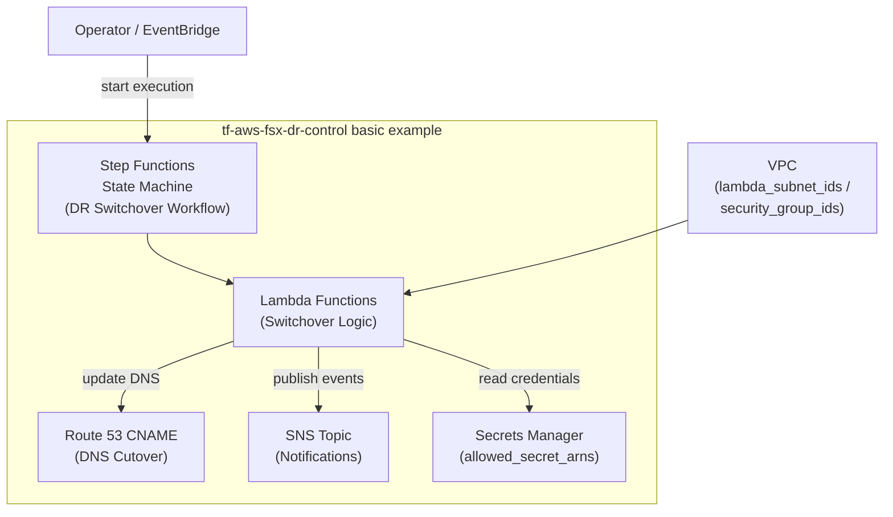

# tf-aws-fsx-dr-control Examples

Runnable examples for the [`tf-aws-fsx-dr-control`](../) Terraform module.

## Available Examples

| Example | Description |
|---------|-------------|
| [basic](basic/) | Minimal configuration — deploys the Step Functions state machine and Lambda functions for FSx ONTAP DR switchover, wired to a Route 53 DNS record and an SNS notification topic |

## Architecture



## Quick Start

```bash
cd basic/
terraform init
terraform apply
```
