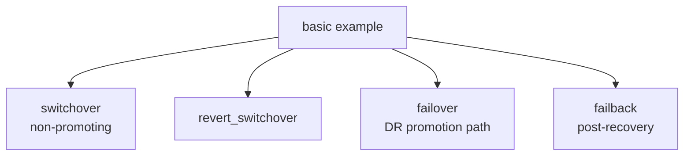

# tf-aws-fsx-dr-control Examples

Runnable examples for the [`tf-aws-fsx-dr-control`](../) Terraform module.

## Available Examples

| Example | Description |
|---------|-------------|
| [basic](basic/) | Minimal configuration for the DR control plane, plus example payloads for switchover, revert_switchover, failover, and failback |

## Scenario Map



## Quick Start

```bash
cd basic/
terraform init
terraform apply
```
