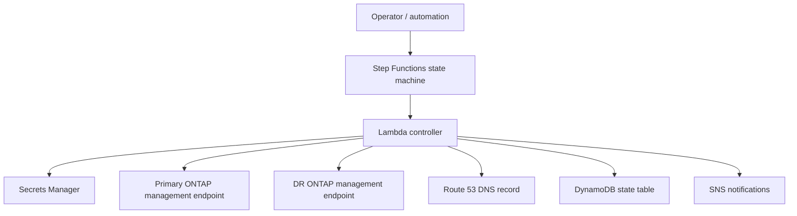
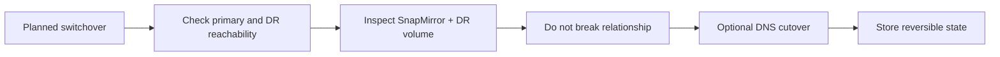
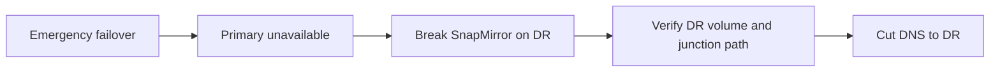
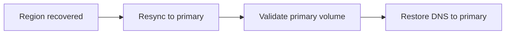

# basic

Minimal deployment of the FSx for ONTAP DR control plane.

## Architecture

## Scenario Flows

### Switchover

### Revert Switchover

### Failover

### Failback

## Outputs to Review

- `switchover_execution_example`
- `revert_switchover_execution_example`
- `failover_execution_example`
- `failback_execution_example`
