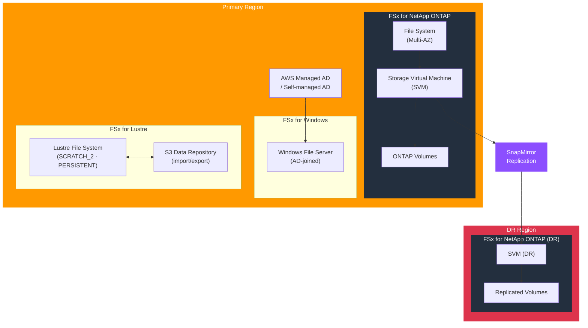

# tf-aws-fsx

Terraform module for Amazon FSx — Windows File Server (AD-integrated), NetApp ONTAP (with SnapMirror cross-region replication), and Lustre (HPC) file systems.

---

## Architecture



---

## Features

- **FSx for Windows** — Active Directory integration, automatic backups, shadow copies
- **FSx for NetApp ONTAP** — SVMs, volumes, SnapMirror cross-region replication, thin provisioning
- **FSx for Lustre** — High-performance scratch/persistent file systems with S3 data repository linking
- KMS encryption at rest across all file system types
- Multi-AZ deployment support for ONTAP and Windows
- NetApp ONTAP SnapMirror: cluster peering, SVM peering, async replication

## Security Controls

| Control | Implementation |
|---------|---------------|
| Encryption at rest | `kms_key_arn` (CMK) |
| AD authentication | Windows — `active_directory_id` |
| Network isolation | Dedicated subnet per file system |
| Backup retention | Configurable `automatic_backup_retention_days` |

## Versioning

Use explicit git tags such as `?ref=v1.0.0` to pin your deployments.

## Usage — FSx for ONTAP with SnapMirror

```hcl
module "fsx" {
  source = "git::https://github.com/your-org/golden_modules.git//tf-aws-fsx?ref=v1.0.0"

  kms_key_arn = module.kms.key_arn

  # NetApp ONTAP
  create_ontap = true
  ontap_config = {
    storage_capacity    = 1024
    deployment_type     = "MULTI_AZ_1"
    throughput_capacity = 512
    subnet_ids          = module.vpc.private_subnet_ids
    route_table_ids     = module.vpc.private_route_table_ids
  }

  svms = {
    primary = {
      name = "svm-prod"
    }
  }

  # SnapMirror to DR region
  enable_snapmirror = true
  snapmirror_destination = {
    management_endpoint = "198.51.100.10"
    intercluster_endpoint = "198.51.100.11"
  }
}
```

## FSx File System Comparison

| Feature | Windows | ONTAP | Lustre |
|---------|---------|-------|--------|
| Protocol | SMB / NFS | NFS / SMB / iSCSI | Lustre (POSIX) |
| AD integration | Native | Via SVM | — |
| Multi-AZ | Yes | Yes | No (PERSISTENT_2) |
| DR replication | DFS | SnapMirror | S3 export |
| Use case | Windows workloads | Enterprise NAS | HPC / ML |

## Examples

- [FSx for Lustre with S3](examples/lustre/)
- [FSx ONTAP Multi-AZ](examples/ontap/)
- [ONTAP SnapMirror DR](examples/ontap-cross-region-dr/)
