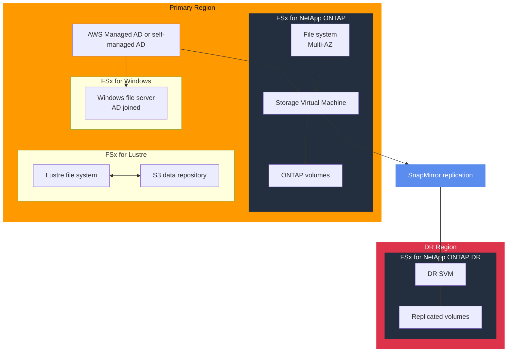

# tf-aws-fsx

Terraform module for Amazon FSx covering Windows File Server, NetApp ONTAP, and Lustre deployments.

---

## Architecture



---

## Features

- FSx for Windows with Active Directory integration
- FSx for NetApp ONTAP with SVMs, volumes, and SnapMirror replication
- FSx for Lustre for high-performance workloads and S3-linked storage
- KMS encryption support across supported file systems
- Multi-AZ deployment support for Windows and ONTAP

## Security Controls

| Control | Implementation |
|---------|---------------|
| Encryption at rest | `kms_key_arn` |
| AD authentication | `active_directory_id` and SVM AD settings |
| Network isolation | Explicit subnet and security group inputs |
| Backup retention | Configurable automatic backup retention settings |

## Versioning

Use explicit git tags such as `?ref=v1.0.0` to pin deployments.

## Usage - FSx for ONTAP with SnapMirror

```hcl
module "fsx" {
  source = "git::https://github.com/your-org/golden_modules.git//tf-aws-fsx?ref=v1.0.0"

  kms_key_arn = module.kms.key_arn

  ontap = {
    storage_capacity    = 1024
    deployment_type     = "MULTI_AZ_1"
    throughput_capacity = 512
    subnet_ids          = module.vpc.private_subnet_ids
  }
}
```

## FSx File System Comparison

| Feature | Windows | ONTAP | Lustre |
|---------|---------|-------|--------|
| Protocol | SMB / NFS | NFS / SMB / iSCSI | Lustre |
| AD integration | Native | Via SVM | No |
| Multi-AZ | Yes | Yes | No |
| DR replication | DFS | SnapMirror | S3 export pattern |
| Use case | Windows workloads | Enterprise NAS | HPC / ML |

## Examples

- [Complete example](examples/complete/)
- [ONTAP SnapMirror DR](examples/ontap-cross-region-dr/)
