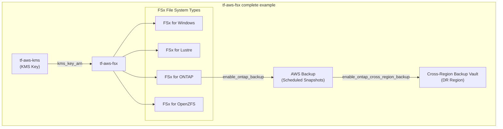

# tf-aws-fsx Examples

Runnable examples for the [`tf-aws-fsx`](../) Terraform module.

## Available Examples

| Example | Description |
|---------|-------------|
| [complete](complete/) | Full configuration — deploys FSx file systems (Windows, Lustre, ONTAP, OpenZFS) with KMS encryption, AWS Backup, and optional cross-region backup for ONTAP |

## Architecture



## Quick Start

```bash
cd complete/
terraform init
terraform apply -var-file="dev.tfvars"
```
