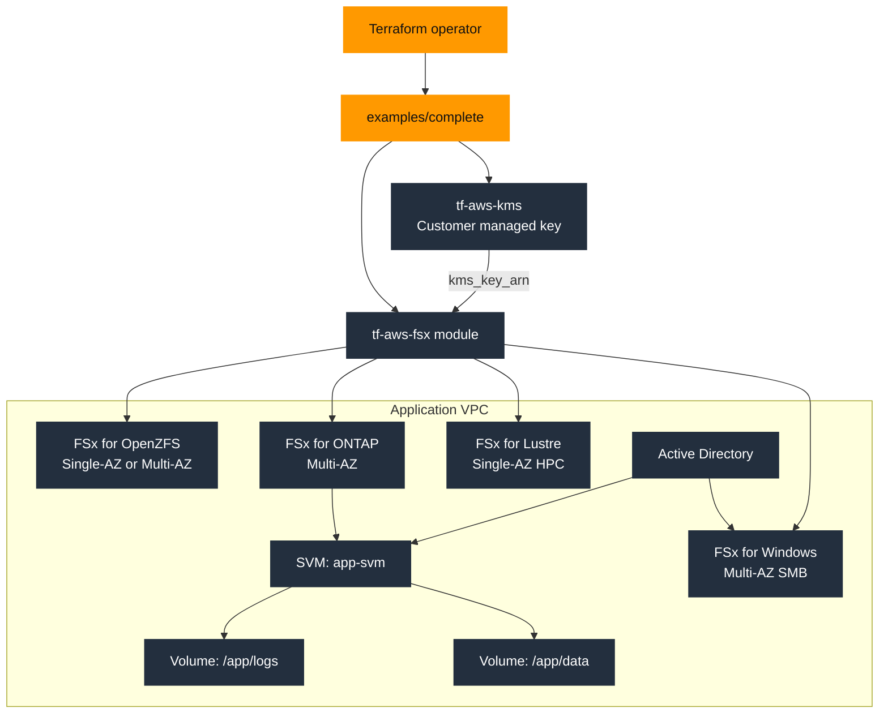

# Complete Example

This example deploys the `tf-aws-fsx` module with a customer-managed KMS key and a single-region FSx layout driven by environment-specific `tfvars` files. Lower environments focus on Windows and ONTAP, while `prod.tfvars` shows Windows, Lustre, ONTAP, and OpenZFS together.

## Architecture



## What This Example Shows

- Customer-managed KMS encryption for FSx resources
- FSx for Windows integrated with Active Directory
- FSx for ONTAP with one SVM and multiple volumes
- `fsxadmin` for ONTAP fetched from Secrets Manager rather than hard-coded in Terraform
- Per-environment inputs through `dev.tfvars`, `staging.tfvars`, and `prod.tfvars`

## HA Notes

- Windows: Multi-AZ is supported and shown in the sample tfvars.
- ONTAP: Multi-AZ plus backup and SnapMirror-based DR are supported.
- Lustre: high-performance, but not Multi-AZ in the same way as Windows or ONTAP.
- OpenZFS: deployment-type options exist, but treat it as a separate HA design track from ONTAP replication.

## Run

```bash
terraform init
terraform apply -var-file="dev.tfvars"
```
