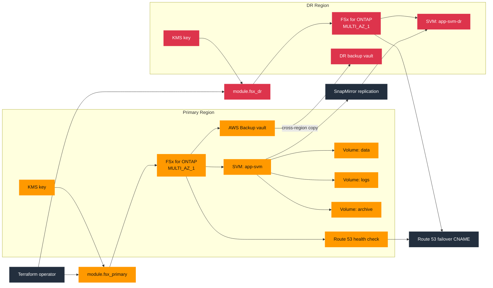

# ONTAP DR Example

This example deploys primary and DR FSx for ONTAP environments and layers AWS Backup, SnapMirror, and Route 53 failover on top. The default shape is cross-region DR, and the same example can also be adapted for same-region replication by placing both clusters in one region and switching to `sync` or `strictSync`.

## Architecture



## What This Example Shows

- Secrets Manager-backed `fsxadmin` credentials for both FSx ONTAP clusters and SnapMirror sessions
- Multi-volume replication for `data`, `logs`, and `archive`
- Volume-level and SVM-level replication
- AWS Backup cross-region copy into a DR vault
- Route 53 failover records for client cutover
- Same-region replication option by setting `primary_region` and `dr_region` to the same value and using `replication_mode = "sync"` or `"strictSync"`

## HA Notes

- FSx for ONTAP supports `MULTI_AZ_1` and is the best fit here for HA plus replication-driven DR.
- FSx for Windows also supports Multi-AZ, but this example is focused on ONTAP replication patterns.
- FSx for Lustre is not a Multi-AZ service; design HA around workload retry and data rehydration.
- FSx for OpenZFS has deployment-type options in the module, but ONTAP-style SnapMirror replication is not implemented for it here.

## Run

```bash
terraform init
terraform apply -target=module.kms_primary -target=module.kms_dr -target=module.fsx_primary -target=module.fsx_dr
terraform apply
```
