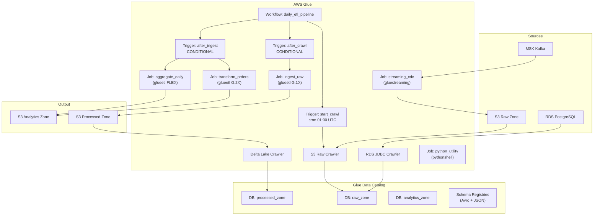

# tf-aws-glue Examples

Runnable examples for the [`tf-aws-glue`](../) Terraform module.

## Available Examples

| Example | Description |
|---------|-------------|
| [minimal](minimal/) | Single ETL job with an auto-created IAM role — no crawlers, triggers, workflows, or connections |
| [complete](complete/) | Production-grade daily ETL pipeline with 3 catalog databases, 5 jobs (ETL/pythonshell/streaming), 3 crawlers (S3/JDBC/Delta Lake), 1 workflow, 3 triggers, 2 schema registries, JDBC/Kafka connections, and KMS security configuration |

## Architecture



## Quick Start

```bash
cd minimal/
terraform init
terraform apply
```

For the complete example:

```bash
cd complete/
terraform init
terraform apply -var-file="dev.tfvars"
```
