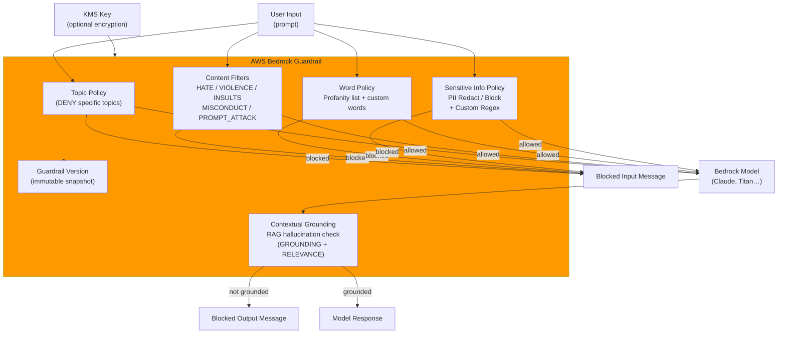

# tf-aws-guardrail

Terraform module for **AWS Bedrock Guardrails** — a standalone content safety layer that can be attached to any Bedrock model invocation or agent.

## Features

| Capability | Description |
|---|---|
| **Topic Policy** | Deny specific conversation topics (e.g. competitor advice, medical prescriptions) |
| **Content Filters** | Strength-based filters for SEXUAL, VIOLENCE, HATE, INSULTS, MISCONDUCT, PROMPT_ATTACK |
| **Word Filters** | Block profanity (AWS-managed list) + custom word/phrase list |
| **PII Redaction** | Anonymize or block 30+ entity types (SSN, email, phone, credit card…) |
| **Custom Regex** | Block proprietary patterns (employee IDs, internal ticket numbers, etc.) |
| **Grounding Check** | Detect RAG hallucinations — block responses not grounded in retrieved context |
| **Versioning** | Publish immutable version snapshots for safe rollouts |

## Architecture



## Versioning

Review [CHANGELOG.md](CHANGELOG.md) before selecting a module version. Use explicit git tags such as `?ref=v1.0.0`, `?ref=v1.1.0`, or `?ref=v2.0.0` so deployments stay predictable.
## Usage

```hcl
module "guardrail" {
  source      = "../../tf-aws-guardrail"
  name        = "customer-support"
  environment = "prod"

  description            = "Guardrail for customer support chatbot"
  blocked_input_message  = "I can't help with that. Please contact support@acme.com."
  blocked_output_message = "I cannot provide that information."

  denied_topics = [
    {
      name       = "competitor-comparison"
      definition = "Any discussion comparing our products to a competitor's product or service."
      examples   = ["How does your product compare to X?", "Is your service better than Y?"]
    }
  ]

  content_filters = [
    { type = "HATE",         input_strength = "HIGH",   output_strength = "HIGH" },
    { type = "INSULTS",      input_strength = "MEDIUM", output_strength = "HIGH" },
    { type = "PROMPT_ATTACK", input_strength = "HIGH",  output_strength = "NONE" },
  ]

  managed_word_lists = ["PROFANITY"]

  pii_entities = [
    { type = "EMAIL",               action = "ANONYMIZE" },
    { type = "PHONE",               action = "ANONYMIZE" },
    { type = "US_SOCIAL_SECURITY_NUMBER", action = "BLOCK" },
    { type = "CREDIT_DEBIT_CARD_NUMBER",  action = "BLOCK" },
  ]
}
```

## Real-World Scenarios

See `examples/` for:

| Example | Scenario |
|---|---|
| `customer-support-bot` | E-commerce support chatbot — block competitor talk, PII, harmful content |
| `healthcare-assistant` | Medical Q&A assistant — strict PII, prescription denial, hallucination check |
| `financial-advisor-bot` | Fintech assistant — investment advice denial, regulatory compliance |

## Inputs

| Name | Type | Default | Description |
|---|---|---|---|
| `name` | `string` | — | Guardrail name |
| `name_prefix` | `string` | `""` | Optional prefix |
| `environment` | `string` | `"dev"` | Deployment environment |
| `description` | `string` | `""` | Guardrail description |
| `blocked_input_message` | `string` | (default) | Message shown when input is blocked |
| `blocked_output_message` | `string` | (default) | Message shown when output is blocked |
| `kms_key_arn` | `string` | `null` | KMS key for encryption |
| `create_version` | `bool` | `true` | Publish versioned snapshot |
| `denied_topics` | `list(object)` | `[]` | Topics to deny |
| `content_filters` | `list(object)` | `[]` | Harmful content filter strengths |
| `managed_word_lists` | `list(string)` | `[]` | AWS-managed word lists (PROFANITY) |
| `custom_words` | `list(string)` | `[]` | Custom words/phrases to block |
| `pii_entities` | `list(object)` | `[]` | PII types and actions |
| `regex_patterns` | `list(object)` | `[]` | Custom regex patterns |
| `grounding_filter` | `object` | `null` | RAG hallucination detection thresholds |

## Outputs

| Name | Description |
|---|---|
| `guardrail_id` | Guardrail ID (used in InvokeModel API calls) |
| `guardrail_arn` | Guardrail ARN |
| `guardrail_version` | Published version number |
| `guardrail_name` | Guardrail name |

