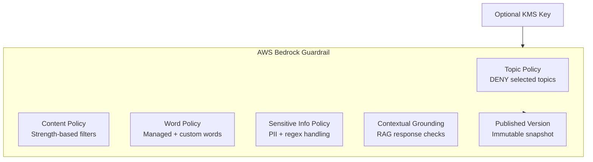
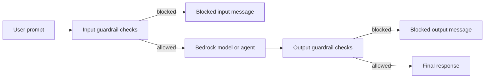
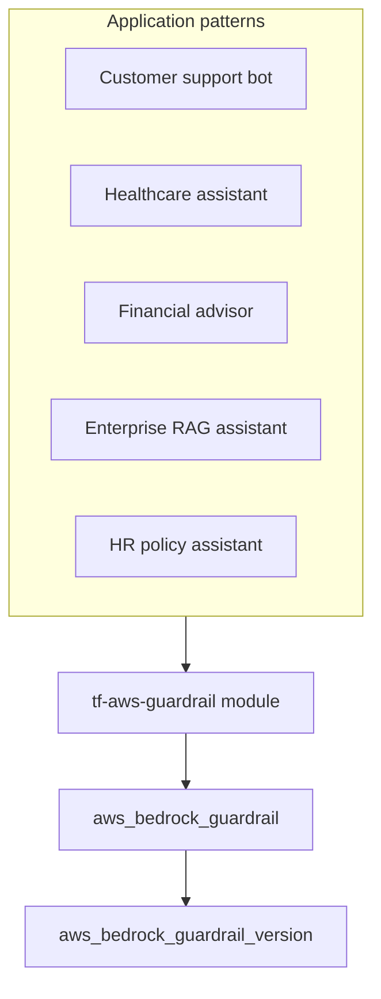

# tf-aws-guardrail

Terraform module for provisioning **AWS Bedrock Guardrails** as a reusable safety layer for Bedrock models and agents.

## What This Module Supports

| Capability | Description |
|---|---|
| Topic policy | Deny sensitive conversation categories such as medical advice or competitor comparisons |
| Content filters | Set input/output strengths for `SEXUAL`, `VIOLENCE`, `HATE`, `INSULTS`, `MISCONDUCT`, and `PROMPT_ATTACK` |
| Word policy | Enable AWS-managed profanity filtering and add custom blocked terms |
| Sensitive information policy | Anonymize or block supported PII entities plus custom regex patterns |
| Contextual grounding | Check whether model output is grounded in retrieved context for RAG workloads |
| Versioning | Publish immutable guardrail versions for controlled rollouts |
| Tagging and encryption | Apply standard tags and optional KMS encryption |

## Architecture

### Policy Composition



### Request Flow



### Common Deployment Patterns



## Usage

```hcl
module "guardrail" {
  source      = "../../tf-aws-guardrail"
  name        = "customer-support"
  environment = "prod"

  description            = "Guardrail for customer support chatbot"
  blocked_input_message  = "I can't help with that. Please contact support@acme.com."
  blocked_output_message = "I cannot provide that information."

  denied_topics = [
    {
      name       = "competitor-comparison"
      definition = "Any discussion comparing our products to a competitor's product or service."
      examples   = ["How does your product compare to X?", "Is your service better than Y?"]
    }
  ]

  content_filters = [
    { type = "HATE",          input_strength = "HIGH",   output_strength = "HIGH" },
    { type = "INSULTS",       input_strength = "MEDIUM", output_strength = "HIGH" },
    { type = "PROMPT_ATTACK", input_strength = "HIGH",   output_strength = "NONE" },
  ]

  managed_word_lists = ["PROFANITY"]

  pii_entities = [
    { type = "EMAIL",                     action = "ANONYMIZE" },
    { type = "PHONE",                     action = "ANONYMIZE" },
    { type = "US_SOCIAL_SECURITY_NUMBER", action = "BLOCK" },
    { type = "CREDIT_DEBIT_CARD_NUMBER",  action = "BLOCK" },
  ]
}
```

## Example Scenarios

See [`examples/`](examples/) for runnable scenarios:

| Example | Focus |
|---|---|
| `customer-support-bot` | Retail support with competitor blocking, profanity filtering, and PII protection |
| `healthcare-assistant` | Clinical assistant with strict PHI controls and grounding checks |
| `financial-advisor-bot` | Fintech assistant with regulated-topic blocking and financial identifier protection |
| `enterprise-rag-assistant` | Internal knowledge assistant with grounding enforcement and secret redaction |
| `hr-policy-assistant` | Employee self-service bot with HR-safe topics and employee data protection |

## Inputs

| Name | Type | Default | Description |
|---|---|---|---|
| `name` | `string` | n/a | Guardrail name |
| `name_prefix` | `string` | `""` | Optional prefix prepended to `name` |
| `environment` | `string` | `"dev"` | Deployment environment |
| `project` | `string` | `""` | Project tag value |
| `owner` | `string` | `""` | Owner tag value |
| `cost_center` | `string` | `""` | Cost-center tag value |
| `tags` | `map(string)` | `{}` | Additional tags merged with local defaults |
| `description` | `string` | `""` | Human-readable guardrail description |
| `blocked_input_message` | `string` | module default | Message returned when user input is blocked |
| `blocked_output_message` | `string` | module default | Message returned when model output is blocked |
| `kms_key_arn` | `string` | `null` | Optional KMS key ARN used for encryption |
| `create_version` | `bool` | `true` | Publish a guardrail version after creation |
| `denied_topics` | `list(object)` | `[]` | Topic definitions to deny |
| `content_filters` | `list(object)` | `[]` | Content filter strengths for supported categories |
| `managed_word_lists` | `list(string)` | `[]` | AWS-managed word lists such as `PROFANITY` |
| `custom_words` | `list(string)` | `[]` | Custom blocked words or phrases |
| `pii_entities` | `list(object)` | `[]` | Supported sensitive entity types and actions |
| `regex_patterns` | `list(object)` | `[]` | Custom regex detections and actions |
| `grounding_filter` | `object` | `null` | Optional grounding and relevance thresholds for RAG |

## Outputs

| Name | Description |
|---|---|
| `guardrail_id` | Bedrock Guardrail identifier used in model invocations |
| `guardrail_arn` | Guardrail ARN |
| `guardrail_version` | Published version number, or `null` when `create_version = false` |
| `guardrail_name` | Final guardrail name |

## Versioning

Review [CHANGELOG.md](CHANGELOG.md) before choosing a module version. Prefer explicit tags such as `?ref=v1.0.0` so deployments stay predictable.
