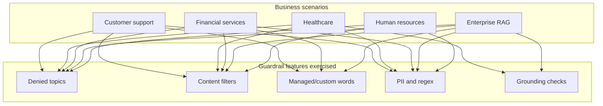

# tf-aws-guardrail Examples

Runnable examples for the [`tf-aws-guardrail`](../) Terraform module.

## Available Examples

| Example | Description |
|---|---|
| [customer-support-bot](customer-support-bot/) | E-commerce support chatbot with competitor blocking, profanity filtering, and customer PII protection |
| [healthcare-assistant](healthcare-assistant/) | Clinical assistant with PHI controls, prescription denial topics, and grounding checks |
| [financial-advisor-bot](financial-advisor-bot/) | Retail investing assistant with regulated-topic denial and financial identifier blocking |
| [enterprise-rag-assistant](enterprise-rag-assistant/) | Internal knowledge assistant with jailbreak defense, secret detection, and grounding enforcement |
| [hr-policy-assistant](hr-policy-assistant/) | HR self-service assistant with employee-data redaction and workplace-safe policy controls |

## Example Map



## Suggested Starting Points

| If you need... | Start with... |
|---|---|
| A broad baseline for public-facing chatbots | `customer-support-bot` |
| A high-control regulated setup | `healthcare-assistant` or `financial-advisor-bot` |
| A RAG-oriented configuration | `enterprise-rag-assistant` |
| An internal employee-help use case | `hr-policy-assistant` |

## Quick Start

```bash
cd examples/customer-support-bot
terraform init
terraform plan
```
