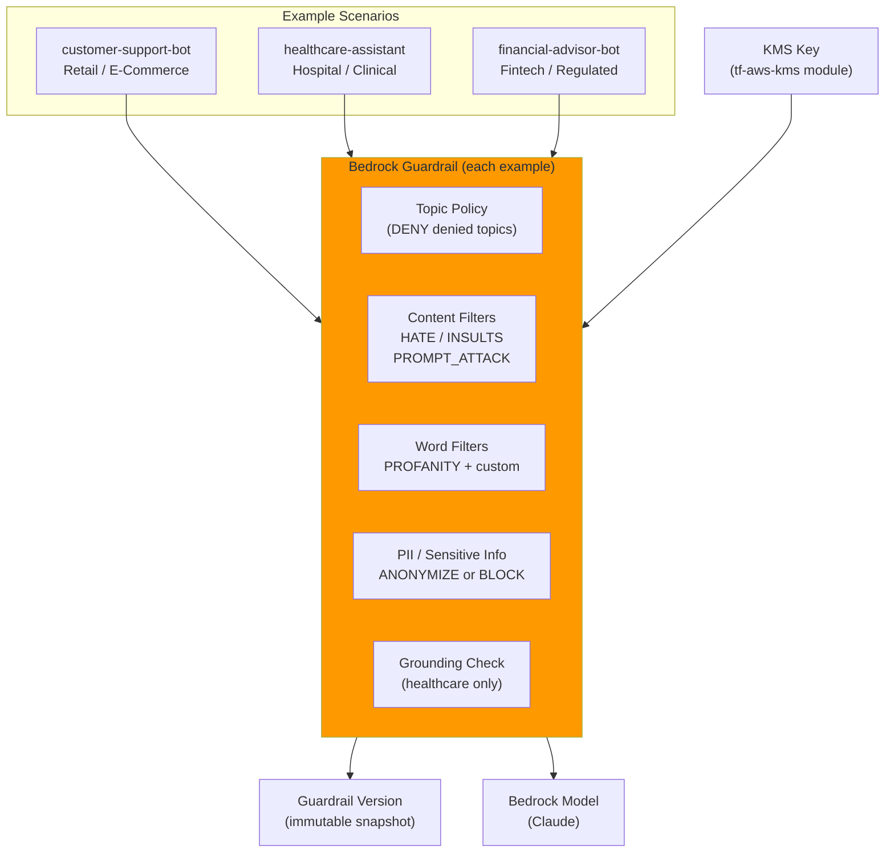

# tf-aws-guardrail Examples

Runnable examples for the [`tf-aws-guardrail`](../) Terraform module.

## Available Examples

| Example | Description |
|---------|-------------|
| [customer-support-bot](customer-support-bot/) | E-commerce support chatbot — blocks competitor comparisons, PII anonymization, hate/insults/prompt-attack filters, profanity list |
| [healthcare-assistant](healthcare-assistant/) | Medical Q&A assistant — strict PHI blocking (HIPAA), prescription denial topic, hallucination grounding check, emergency redirects |
| [financial-advisor-bot](financial-advisor-bot/) | Fintech advisor — investment advice denial, competitor product blocking, full PII block (SSN, bank accounts, IBAN), prompt injection defense |

## Architecture



## Quick Start

```bash
cd customer-support-bot/
terraform init
terraform apply -var-file="dev.tfvars"
```
