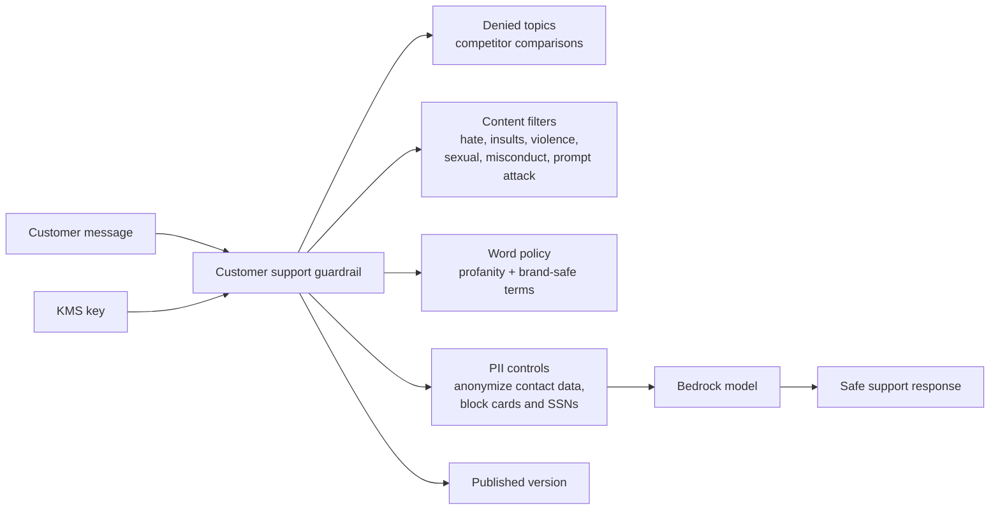

# customer-support-bot

Example Bedrock Guardrail for a public-facing e-commerce support chatbot.

## Architecture



## What This Example Shows

- Competitor and financial-advice topic denial
- Profanity plus custom word blocking
- Customer PII anonymization and payment-data blocking
- Versioned guardrail protected by a dedicated KMS key

## Run

```bash
terraform init
terraform plan
```
