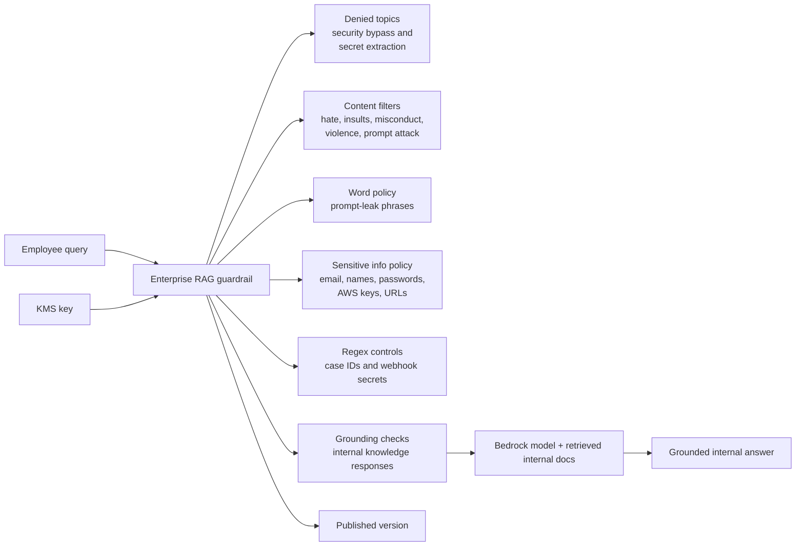

# enterprise-rag-assistant

Example Bedrock Guardrail for an internal RAG assistant serving company knowledge.

## Architecture



## What This Example Shows

- Prompt-injection and secret-extraction defense
- Redaction/blocking of sensitive enterprise data
- Regex handling for internal IDs and leaked webhooks
- Strong grounding thresholds for internal RAG

## Run

```bash
terraform init
terraform plan
```
