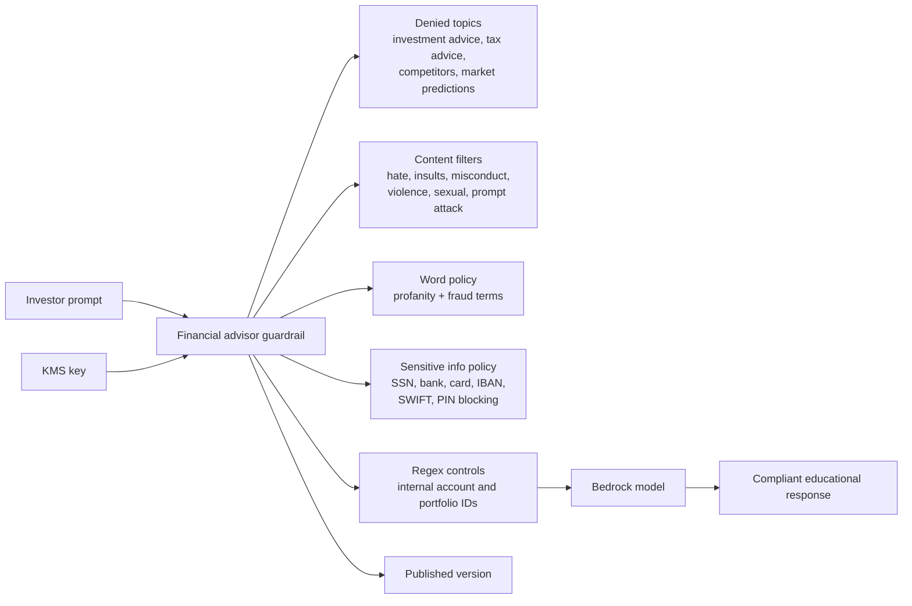

# financial-advisor-bot

Example Bedrock Guardrail for a retail-investing assistant in a regulated environment.

## Architecture



## What This Example Shows

- SEC/FINRA-style topic restrictions
- Fraud-related custom word filters
- Strict financial identifier blocking
- Internal account pattern protection

## Run

```bash
terraform init
terraform plan
```
