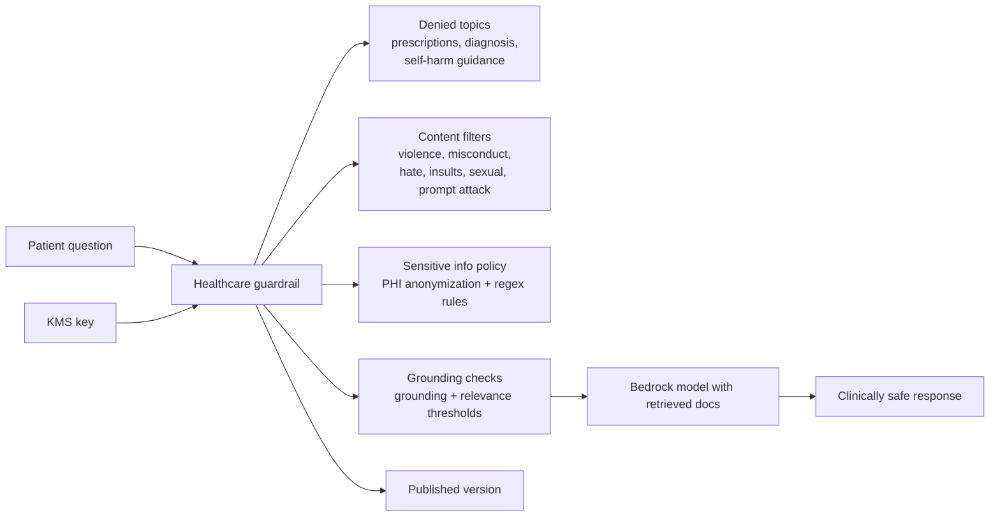

# healthcare-assistant

Example Bedrock Guardrail for a healthcare Q&A assistant with strict safety controls.

## Architecture



## What This Example Shows

- High-risk medical topic denial
- PHI protection with entity rules and custom regex patterns
- Grounding enforcement for RAG-style medical responses
- Emergency-safe blocked messaging

## Run

```bash
terraform init
terraform plan
```
