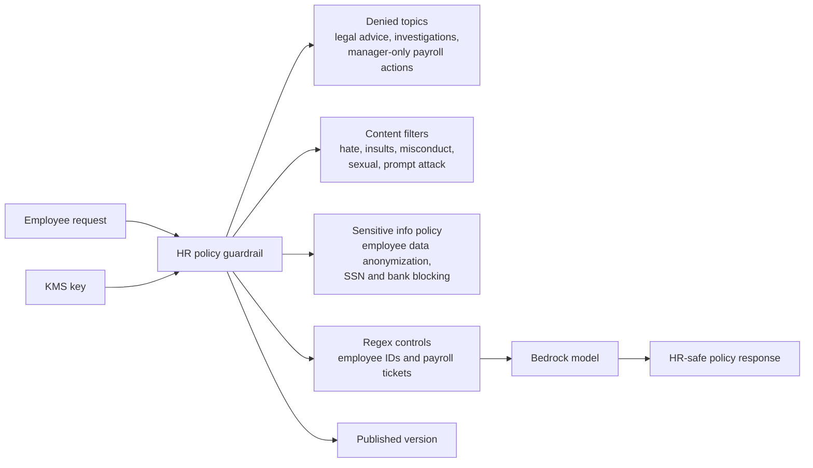

# hr-policy-assistant

Example Bedrock Guardrail for an internal HR self-service assistant.

## Architecture



## What This Example Shows

- Workplace-safe topic restrictions
- Protection for employee and payroll data
- Regex coverage for internal HR identifiers
- Guardrail versioning for controlled rollouts

## Run

```bash
terraform init
terraform plan
```
