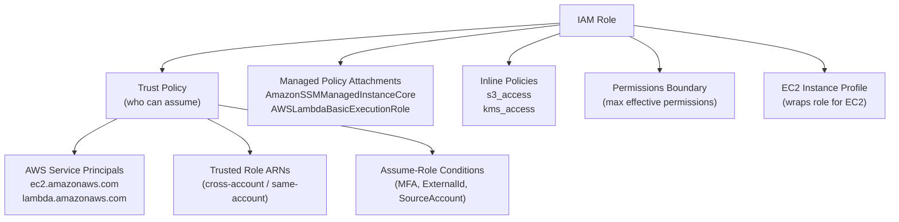

# tf-aws-iam-role

Terraform module for AWS IAM Roles with trust policy, managed/inline policies, and optional EC2 instance profile.

## Features

- Trust policy generation from role ARNs, service principals, and custom conditions
- Attach any number of managed policy ARNs
- Inline policies as a map
- Optional EC2 instance profile
- Permissions boundary support
- Full tagging

## Architecture



## Versioning

Review [CHANGELOG.md](CHANGELOG.md) before selecting a module version. Use explicit git tags such as `?ref=v1.0.0`, `?ref=v1.1.0`, or `?ref=v2.0.0` so deployments stay predictable.
## Usage

```hcl
# EC2 instance role
module "ec2_role" {
  source = "git::https://github.com/your-org/tf-modules.git//tf-aws-iam-role?ref=v1.0.0"

  name                    = "app-server"
  environment             = "prod"
  trusted_role_services   = ["ec2.amazonaws.com"]
  create_instance_profile = true
  managed_policy_arns = [
    "arn:aws:iam::aws:policy/AmazonSSMManagedInstanceCore"
  ]
}

# Lambda role
module "lambda_role" {
  source = "git::https://github.com/your-org/tf-modules.git//tf-aws-iam-role?ref=v1.0.0"

  name                  = "my-function"
  trusted_role_services = ["lambda.amazonaws.com"]
  managed_policy_arns   = ["arn:aws:iam::aws:policy/service-role/AWSLambdaBasicExecutionRole"]
}
```

## Examples

- [Basic](examples/basic/)
- [Complete](examples/complete/)

