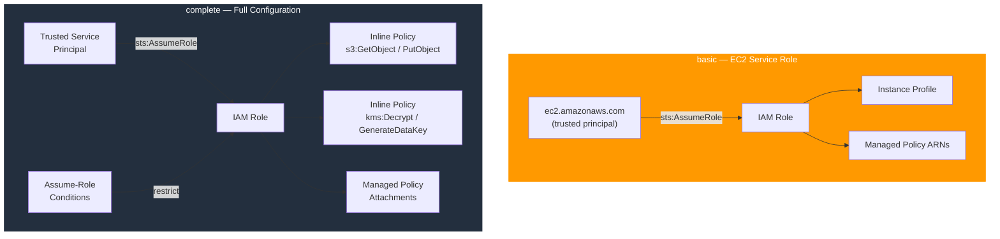

# tf-aws-iam-role Examples

Runnable examples for the [`tf-aws-iam-role`](../) Terraform module.

## Available Examples

| Example | Description |
|---------|-------------|
| [basic](basic/) | Minimal EC2 service role — trusted service principal, optional instance profile, and managed policy attachments |
| [complete](complete/) | Full configuration with tagging, assume-role conditions, custom session duration, and inline policies for S3 and KMS access |

## Architecture



## Quick Start

```bash
cd basic/
terraform init
terraform apply -var-file="dev.tfvars"
```
