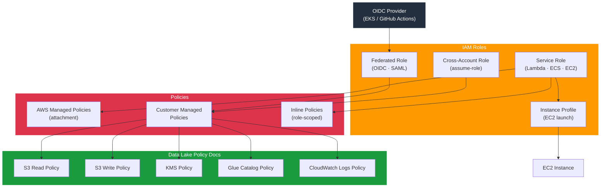

# tf-aws-iam

Terraform module for AWS IAM — roles with trust policies (service, cross-account, OIDC/federated), managed and inline policy attachments, customer-managed policies, instance profiles, and reusable data-lake policy documents.

---

## Architecture



---

## Features

- Roles with multiple trust policy types: service principals, AWS account/role, OIDC (EKS/GitHub), SAML federation
- OIDC conditions for workload identity (e.g., `sub = system:serviceaccount:…`)
- Managed policy attachments and inline policy blocks
- Customer-managed policy resources with optional JSON
- EC2 instance profiles for seamless launch-template integration
- Pre-built data-lake policy document outputs (S3, KMS, Glue, CloudWatch)
- Configurable `max_session_duration` per role

## Security Controls

| Control | Implementation |
|---------|---------------|
| Least privilege | Separate roles per workload |
| OIDC trust conditions | `StringEquals` on `sub` claim |
| No wildcard resources | Policy documents scope to named ARNs |
| Session duration limit | `max_session_duration` (default 1 h) |

## Versioning

Use explicit git tags such as `?ref=v1.0.0` to pin your deployments.

## Usage

```hcl
module "iam" {
  source = "git::https://github.com/your-org/golden_modules.git//tf-aws-iam?ref=v1.0.0"

  roles = {
    lambda_processor = {
      description        = "Lambda data processing role"
      service_principals = ["lambda.amazonaws.com"]
      managed_policy_arns = [
        "arn:aws:iam::aws:policy/service-role/AWSLambdaVPCAccessExecutionRole",
      ]
      inline_policies = {
        s3_access = data.aws_iam_policy_document.s3.json
      }
      create_instance_profile = false
    }
    eks_node = {
      description        = "EKS worker node role"
      service_principals = ["ec2.amazonaws.com"]
      managed_policy_arns = [
        "arn:aws:iam::aws:policy/AmazonEKSWorkerNodePolicy",
        "arn:aws:iam::aws:policy/AmazonEC2ContainerRegistryReadOnly",
      ]
      create_instance_profile = true
    }
    github_actions = {
      description = "GitHub Actions OIDC role"
      federated_principals = ["arn:aws:iam::123456789012:oidc-provider/token.actions.githubusercontent.com"]
      oidc_conditions = {
        test     = "StringLike"
        variable = "token.actions.githubusercontent.com:sub"
        values   = ["repo:your-org/your-repo:*"]
      }
    }
  }
}
```

## Data Lake Policy Outputs

The module exposes reusable policy document outputs that can be attached to any role:

| Output | Grants |
|--------|--------|
| `data_lake_read_policy` | S3 GetObject + KMS Decrypt on data lake buckets |
| `data_lake_write_policy` | S3 PutObject + KMS GenerateDataKey |
| `glue_catalog_policy` | Glue GetDatabase, GetTable, GetPartitions |
| `cloudwatch_logs_policy` | CreateLogGroup, CreateLogStream, PutLogEvents |

## Examples

- [Service Roles](examples/service-roles/)
- [OIDC for EKS Workload Identity](examples/oidc-eks/)
- [Cross-Account Trust](examples/cross-account/)
