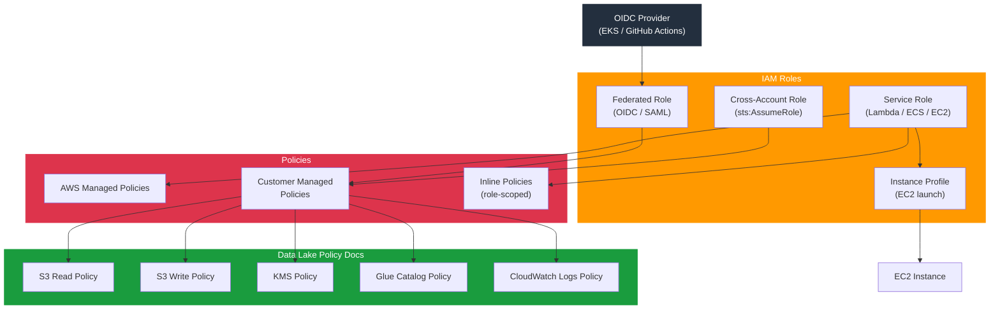

# tf-aws-iam Examples

Runnable examples for the [`tf-aws-iam`](../) Terraform module.

## Available Examples

| Example | Description |
|---------|-------------|
| [minimal](minimal/) | Minimal configuration — provider and version constraints only, no IAM resources created |
| [complete](complete/) | Full configuration with service, cross-account, and federated roles, managed and inline policy attachments, customer-managed policies, and instance profiles |
| [data-platform](data-platform/) | Data lake pattern — S3 read/write roles with KMS, Glue Catalog, and CloudWatch Logs policies for an analytics platform |

## Architecture



## Quick Start

```bash
cd complete/
terraform init
terraform apply -var-file="dev.tfvars"
```
