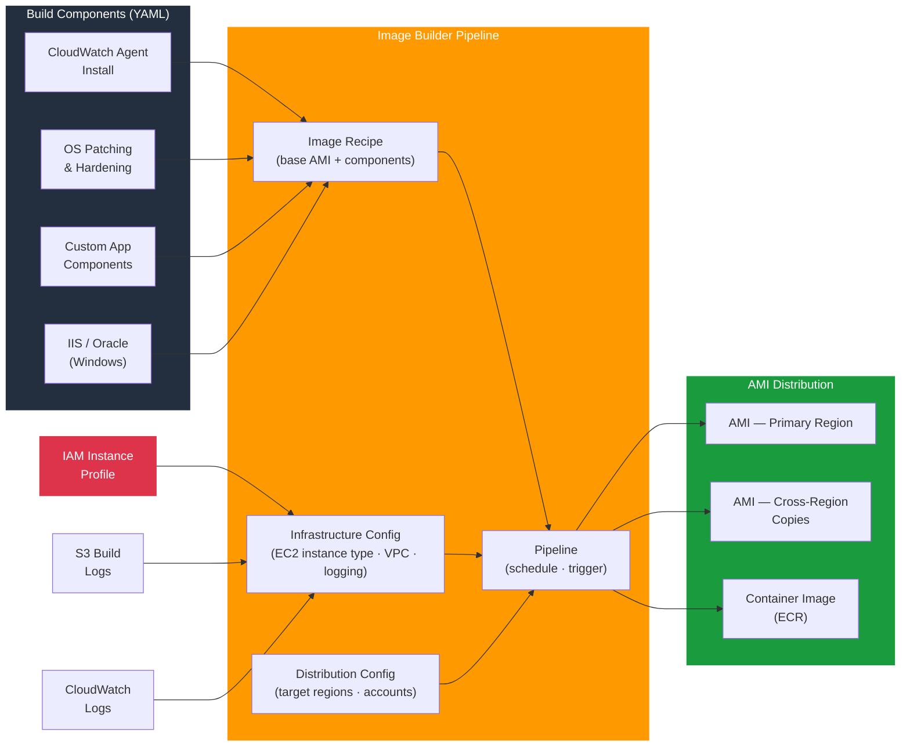

# tf-aws-image-builder

Terraform module for AWS Image Builder — automated AMI pipelines with custom components, infrastructure configuration, distribution, and scheduled builds for Linux and Windows.

---

## Architecture



---

## Features

- Image recipes combining a parent AMI with ordered build components
- Custom components defined as YAML documents (validate, build, test phases)
- Pre-built optional components: CloudWatch Agent, Dynatrace, Oracle Client, IIS, Grafana Agent
- Infrastructure configuration: EC2 instance type, VPC/subnet, key pair, SNS notifications
- Distribution configuration: AMI tags, launch permissions, cross-region copy, ECR container push
- Scheduled pipeline triggers with configurable cron expressions
- IAM instance profile automatically created for build instances
- Build logs shipped to S3 and/or CloudWatch Logs

## Security Controls

| Control | Implementation |
|---------|---------------|
| Scoped build permissions | Dedicated IAM instance profile (min privilege) |
| Encrypted AMIs | KMS key specified in distribution config |
| Private build subnet | VPC + private subnet for build instances |
| No SSH by default | SSM Session Manager for build access |
| Component integrity | YAML component validation phase |

## Versioning

Use explicit git tags such as `?ref=v1.0.0` to pin your deployments.

## Usage

```hcl
module "image_builder" {
  source = "git::https://github.com/your-org/golden_modules.git//tf-aws-image-builder?ref=v1.0.0"

  name           = "hardened-amazon-linux"
  platform       = "Linux"
  parent_image   = "arn:aws:imagebuilder:us-east-1:aws:image/amazon-linux-2023-x86/x.x.x"
  recipe_version = "1.0.0"

  install_cloudwatch_agent = true

  custom_components = {
    app_install = {
      version     = "1.0.0"
      description = "Install application dependencies"
      data        = file("${path.module}/components/app_install.yaml")
    }
  }

  infrastructure = {
    instance_type = "m6i.large"
    vpc_id        = module.vpc.vpc_id
    subnet_id     = module.vpc.private_subnet_ids[0]
  }

  distribution = {
    ami_distribution = {
      name = "hardened-al2023-{{imagebuilder:buildDate}}"
      launch_permission_account_ids = ["123456789012"]
    }
  }

  schedule_cron = "cron(0 2 ? * MON *)" # Weekly Monday 02:00 UTC
}
```

## Platform Support

| Platform | Parent Image | Optional Components |
|----------|-------------|---------------------|
| Amazon Linux 2023 | `amazon-linux-2023-x86` | CWA, Dynatrace, Grafana |
| Windows Server 2022 | `windows-server-2022-x86` | IIS, Oracle Client, CWA |
| Ubuntu 22.04 | `ubuntu-server-22-lts-x86` | CWA, Grafana |

## Examples

- [Linux Hardened AMI](examples/linux/)
- [Windows with IIS](examples/windows/)
