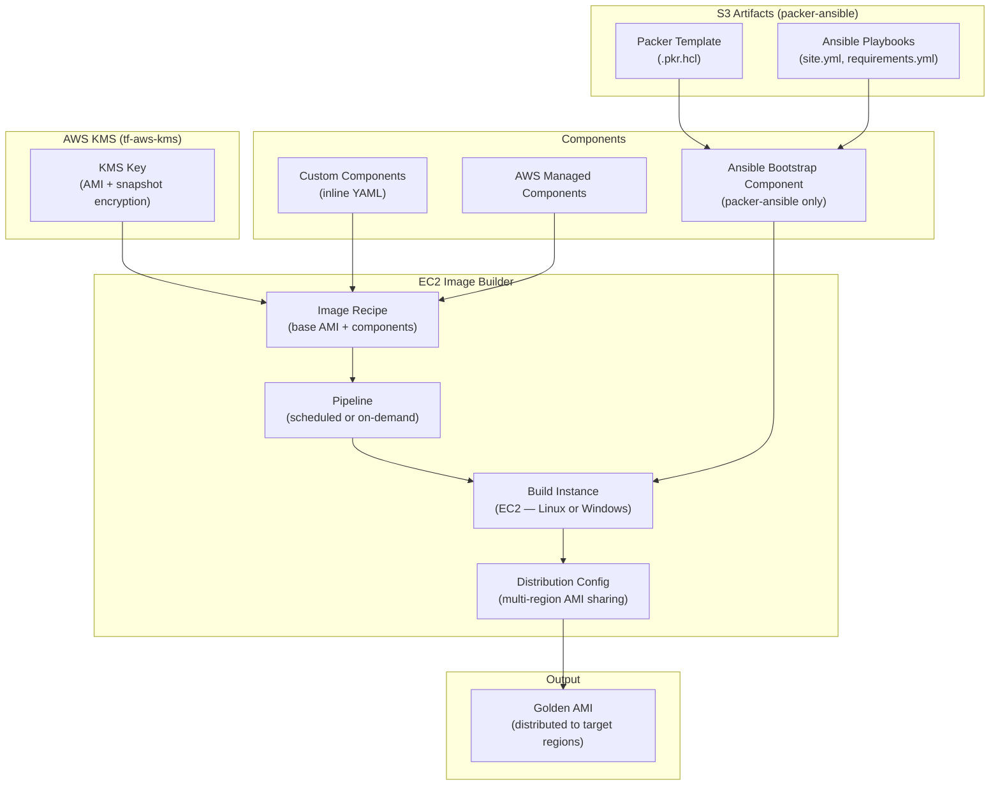

# tf-aws-image-builder Examples

Runnable examples for the [`tf-aws-image-builder`](../) Terraform module.

## Available Examples

| Example | Description |
|---------|-------------|
| [linux](linux/) | EC2 Image Builder pipeline for Linux AMIs with KMS encryption, configurable instance types, custom components, scheduled pipeline, and multi-region distribution |
| [windows](windows/) | EC2 Image Builder pipeline for Windows AMIs with KMS encryption, domain-join support, AMI launch permissions, and mixed-instance distribution |
| [packer-ansible](packer-ansible/) | Hybrid approach — EC2 Image Builder pipeline that downloads Packer templates and Ansible playbooks from S3 and runs them inside the build instance; supports both Linux and Windows platforms |

## Architecture



## Quick Start

Linux AMI:

```bash
cd linux/
terraform init
terraform apply -var-file="dev.tfvars"
```

Windows AMI:

```bash
cd windows/
terraform init
terraform apply -var-file="dev.tfvars"
```

Packer + Ansible pipeline:

```bash
cd packer-ansible/
terraform init
terraform apply -var-file="dev.tfvars"
```
